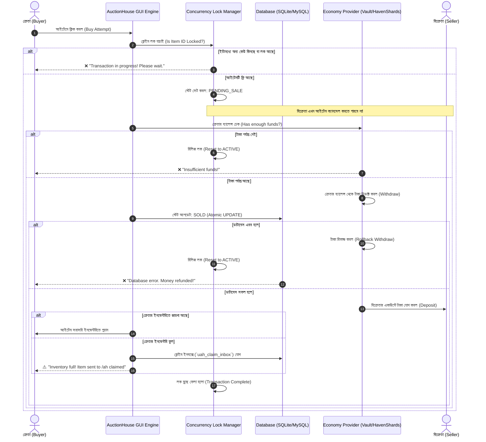

# 🏛️ Ultimate AuctionHouse Plugin: Final Technical Specification & Implementation Blueprint

> **প্রকল্প:** কাস্টম মডার্ন, হাই-পারফরম্যান্স এবং ১০০% ডুপ-প্রুফ (Dupe-Proof) Minecraft AuctionHouse প্লাগিন  
> **টার্গেট প্ল্যাটফর্ম:** Paper, Purpur, Folia (Minecraft 1.20 - 1.21+)  
> **সাপোর্টেড ইকোনমি:** Vault, **HavenShards**, PlayerPoints, CoinsEngine, Item Currency (Diamonds/Emeralds), EXP  
> **ডাটাবেস ও নেটওয়ার্ক:** SQLite, MySQL / MariaDB, Redis Pub/Sub  

---

## 📑 সূচিপত্র (Table of Contents)
1. [প্রকল্প পরিচিতি ও মূল লক্ষ্য (Project Overview)](#1-প্রকল্প-পরিচিতি-ও-মূল-লক্ষ্য-project-overview)
2. [কোর আর্কিটেকচার ও পারফরম্যান্স (Core Architecture)](#2-কোর-আর্কিটেকচার-ও-পারফরম্যান্স-core-architecture)
3. [১০০% ডুপ-প্রুফ সেফটি ও ট্রানজেকশন আর্কিটেকচার (Anti-Dupe & Concurrency Engine)](#3-১০০-ডুপ-প্রুফ-সেফটি-ও-ট্রানজেকশন-আর্কিটেকচার-anti-dupe--concurrency-engine)
4. [মাল্টি-ইকোনমি ও HavenShards ইন্টিগ্রেশন (Multi-Economy Engine)](#4-মাল্টি-ইকোনমি-ও-havenshards-ইন্টিগ্রেশন-multi-economy-engine)
5. [GUI ও ইউজার ইন্টারফেস স্পেসিফিকেশন (Modern UI/UX Layouts)](#5-gui-ও-ইউজার-ইন্টারফেস-স্পেসিফিকেশন-modern-uiux-layouts)
6. [ক্যাটাগরি ও অ্যাডভান্সড রুলস ইঞ্জিন (Categories & Rules Engine)](#6-ক্যাটাগরি-ও-অ্যাডভান্সড-রুলস-ইঞ্জিন-categories--rules-engine)
7. [কমান্ড ও পারমিশন সিস্টেম (Commands & Permissions)](#7-কমান্ড-ও-পারমিশন-সিস্টেম-commands--permissions)
8. [ক্রস-সার্ভার সিনক্রোনাইজেশন ও নেটওয়ার্ক সাপোর্ট (Cross-Server Sync)](#8-ক্রস-সার্ভার-সিনক্রোনাইজেশন-ও-নেটওয়ার্ক-সাপোর্ট-cross-server-sync)
9. [ডিসকর্ড ওয়েবহুক ইন্টিগ্রেশন (Discord Webhook Integration)](#9-ডিসকর্ড-ওয়েবহুক-ইন্টিগ্রেশন-discord-webhook-integration)
10. [প্রস্তাবিত কনফিগারেশন ফাইল স্ট্রাকচার (Config File Architecture)](#10-প্রস্তাবিত-কনফিগারেশন-ফাইল-স্ট্রাকচার-config-file-architecture)
11. [ডাটাবেস স্কিমা ডিজাইন (Production Database Schema)](#11-ডাটাবেস-স্কিমা-ডিজাইন-production-database-schema)
12. [ধাপে ধাপে ডেভেলপমেন্ট রোডম্যাপ (Implementation Roadmap)](#12-ধাপে-ধাপে-ডেভেলপমেন্ট-রোডম্যাপ-implementation-roadmap)

---

## 1. প্রকল্প পরিচিতি ও মূল লক্ষ্য (Project Overview)

এই প্লাগিনটির মূল লক্ষ্য হলো মাইনক্রাফট সার্ভারগুলোর জন্য সবচেয়ে দ্রুতগতির, আধুনিক এবং সম্পূর্ণ ডুপ-প্রুফ একটি অকশন হাউস তৈরি করা।

### প্রধান স্তম্ভসমূহ:
* **জিরো-ডুপ গ্যারান্টি (Zero-Dupe Guarantee):** ইনভেন্টরি ফুল থাকলে কোনো আইটেম মাটিতে পড়বে না। সবকিছু সেফ ক্লেইম ইনবক্সে জমা থাকবে।
* **মাল্টি-ইকোনমি ইন্টিগ্রেশন:** সাধারণ সার্ভার মানি ছাড়াও আপনার নিজস্ব **HavenShards** (`E:\Develop\Plugins\HavenShards`), প্লেয়ার পয়েন্টস এবং সরাসরি ইনভেন্টরি আইটেম (ডায়মন্ড/এমারেল্ড) দিয়ে লেনদেন।
* **স্ট্যান্ডঅ্যালোন প্রিমিয়াম GUI:** কোনো থার্ড-পার্টি মেনু প্লাগিন ছাড়াই আধুনিক হেক্স কালার, MiniMessage, এবং শুলকার বক্স ইনস্পেকশন সহ সম্পূর্ণ নিজস্ব GUI ফ্রেমওয়ার্ক।
* **হাই-পারফরম্যান্স ও Folia সাপোর্ট:** রিজিওনাল থ্রেডিং এবং অ্যাসিঙ্ক্রোনাস ডাটাবেস অপারেশন, যাতে হাজার হাজার লিস্টিং থাকলেও সার্ভার টিপিএস ২০ থাকে।
* **রিয়েলটাইম ক্রস-সার্ভার সিঙ্ক:** MySQL এবং Redis Pub/Sub দিয়ে মাল্টি-সার্ভার নেটওয়ার্কে মিলি-সেকেন্ডে আইটেম আপডেট।

---

## 2. কোর আর্কিটেকচার ও পারফরম্যান্স (Core Architecture)

```
┌────────────────────────────────────────────────────────────────────────┐
│                        Ultimate AuctionHouse                           │
├──────────────────────────────────┬─────────────────────────────────────┤
│ • Paper & Folia Native Engine    │ • HikariCP Database Connection Pool │
│ • Kyori MiniMessage & Adventure  │ • Redis Pub/Sub Real-time Syncer    │
│ • Async Item Serialization (NBT) │ • SortedItemsCache (In-Memory RAM)  │
└──────────────────────────────────┴─────────────────────────────────────┘
```

1. **Folia ও Paper অ্যাসিঙ্ক্রোনাস শিডিউলার:**
   - ডেটাবেস কোয়েরি, ডিসকর্ড রিকোয়েস্ট এবং ফাইল রিড/রাইট কোনো অবস্থাতেই সার্ভারের মেইন টিক থ্রেডে চলবে না।
   - Folia সার্ভারের জন্য `GlobalRegionScheduler` এবং `EntityScheduler` ব্যবহার করে থ্রেড-সেফ এক্সিকিউশন নিশ্চিত করা হবে।
2. **কানেকশন পুলিং (HikariCP):**
   - SQLite (একক সার্ভারের জন্য ডিফল্ট) এবং MySQL / MariaDB (নেটওয়ার্কের জন্য) এর জন্য উচ্চগতির HikariCP কানেকশন পুল ব্যবহার করা হবে।
3. **ইন-মেমরি ক্যাশিং (`SortedItemsCache`):**
   - প্রতিবার মেনু খোলার সময় ডাটাবেস থেকে ডাটা ফেচ হবে না।
   - সমস্ত সক্রিয় লিস্টিং র‍্যামে (RAM) ক্যাশ থাকবে এবং সর্টিং (Lowest Price, Highest Price, Newest) ইনস্ট্যান্টলি সম্পন্ন হবে।

---

## 3. ১০০% ডুপ-প্রুফ সেফটি ও ট্রানজেকশন আর্কিটেকচার (Anti-Dupe & Concurrency Engine)

মাইনক্রাফট ট্রেডিংয়ের সকল পরিচিত গ্লিচ ও ডুপ বন্ধ করতে নিচের ট্রানজেকশন লাইফসাইকেল বাধ্যতামূলক:



### ৩টি আবশ্যিক নিরাপত্তা বৈশিষ্ট্য:
1. **Row-Level Concurrency Lock (`PENDING_SALE`):**
   - ক্রেতা যখন কনফার্মেশন স্ক্রিনে থাকে, আইটেমটি তাত্ক্ষণিকভাবে মেমোরি ও ডাটাবেসে লক হয়ে যাবে। ফলে অন্য কোনো ক্রেতা একযোগে কিনতে পারবে না এবং বিক্রেতাও আইটেম ফেরত নিতে পারবে না।
2. **জিরো-ড্রপ ক্লেইম ইনবক্স (Zero-Drop Delivery):**
   - কেনা আইটেম বা মেয়াদোত্তীর্ণ আইটেম গ্রহণের সময় ইনভেন্টরি ফুল থাকলে আইটেম **মাটিতে ড্রপ করবে না**। সরাসরি `/ah claimed` বা `/ah expired` ইনবক্সে জমা থাকবে। প্লেয়ার যখন ইচ্ছা ফাঁকা ইনভেন্টরি নিয়ে ক্লেইম করতে পারবে।
3. **পারমাণবিক (Two-Phase Commit) ট্রানজেকশন:**
   - টাকা কাটা ➔ ডাটাবেস আপডেট ➔ বিক্রেতাকে টাকা প্রদান ➔ আইটেম ডেলিভারি। কোনো একটি ধাপে ত্রুটি হলে পূর্ববর্তী ধাপগুলো স্বয়ংক্রিয়ভাবে রোলব্যাক (Rollback/Refund) হবে।

---

## 4. মাল্টি-ইকোনমি ও HavenShards ইন্টিগ্রেশন (Multi-Economy Engine)

প্লাগিনে একাধিক কারেন্সি সাপোর্ট থাকবে, যার মাধ্যমে প্লেয়াররা ইচ্ছামতো কারেন্সিতে পণ্য বিক্রি করতে পারবে:

```
        ┌────────────────────────────────────────────────────────┐
        │               Unified Economy Router                   │
        └──────────────────────────┬─────────────────────────────┘
                                   │
       ┌─────────────────┬─────────┴─────────┬──────────────────┐
       ▼                 ▼                   ▼                  ▼
┌─────────────┐   ┌─────────────┐    ┌───────────────┐   ┌──────────────┐
│    Vault    │   │ HavenShards │    │  CoinsEngine  │   │ Item-Economy │
│ (Standard)  │   │ (Custom API)│    │ /PlayerPoints │   │(Diamond/Gold)│
└─────────────┘   └─────────────┘    └───────────────┘   └──────────────┘
```

### ক) 💎 HavenShards সরাসরি ইন্টিগ্রেশন (`E:\Develop\Plugins\HavenShards`)
আপনার কাস্টম `HavenShards` প্লাগিনের অফিশিয়াল API সরাসরি হুক করা হবে:
* **API ক্লাস:** `com.haven.shards.api.HavenShardsAPI`
* **ব্যালেন্স চেক:** `HavenShardsAPI.hasBalance(buyer, price)`
* **টাকা ডিডাক্ট:** `HavenShardsAPI.removeBalance(buyer.getUniqueId(), price)`
* **অনলাইন বিক্রেতাকে পেমেন্ট:** `HavenShardsAPI.addBalance(sellerUUID, finalPrice)`
* **অফলাইন বিক্রেতাকে পেমেন্ট:** `HavenShardsAPI.modifyOfflineBalance(offlinePlayer, finalPrice, callback)`  
  *(HavenShards-এর বিল্ট-ইন অ্যাসিনক্রোনাস অফলাইন হ্যান্ডলার ব্যবহার করে অফলাইন সেলারের ব্যালেন্স নিরাপদভাবে আপডেট করা হবে)*

### খ) সাপোর্টেড কারেন্সি তালিকা:
1. **Vault / VaultUnlocked:** স্ট্যান্ডার্ড সার্ভার ডলার।
2. **HavenShards:** আপনার সার্ভারের নিজস্ব শার্ড কারেন্সি (`✦ Shards`)।
3. **PlayerPoints & CoinsEngine:** পয়েন্ট বা সেকেন্ডারি কয়েন।
4. **Item Currency (Vanilla Trading):** ডায়মন্ড, এমারেল্ড বা কাস্টম টোকেন সরাসরি কারেন্সি হিসেবে লেনদেন।
5. **EXP Currency:** এক্সপি পয়েন্ট বা এক্সপি লেভেল দিয়ে বেচাকেনা।

### গ) `economies.yml` কনফিগারেশন স্পেক:
```yaml
economies:
  - type: VAULT
    name: vault
    display-name: "<#00fc88>Money"
    format: "$%price%"
    symbol: "$"
    is-enable: true
    min-price: 10
    max-price: 1000000000
    fee-percentage: 2 # ২% সেলস ট্যাক্স

  - type: HAVEN_SHARDS
    name: shard
    aliases: [shards, havencoin]
    display-name: "<#a855f7>✦ Shards"
    format: "%price% <#a855f7>✦"
    symbol: "✦"
    is-enable: true
    min-price: 1
    max-price: 5000000
    fee-percentage: 3 # ৩% শার্ড ট্যাক্স
    auto-claim: true

  - type: ITEM
    name: diamond
    display-name: "<#00d4ff>💎 Diamond"
    material: DIAMOND
    format: "%price% Diamonds"
    symbol: "💎"
    is-enable: true
```

---

## 5. GUI ও ইউজার ইন্টারফেস স্পেসিফিকেশন (Modern UI/UX Layouts)

কোনো বহিরাগত মেনু প্লাগিনের সাহায্য ছাড়াই সম্পূর্ণ নিজস্ব হাই-পারফরম্যান্স GUI ইঞ্জিন।

### ক) মেইন অকশন ব্রাউজার (`main.yml` - ৫৪ স্লট লেআউট)
* **স্লট ০ - ৪৪ (৪৫টি স্লট):** অকশন লিস্টিং প্রদর্শনের স্থান।
* **স্লট ৪৫ - ৫৩ (কন্ট্রোল বার):**
  - `Slot 45:` ◀ পূর্ববর্তী পৃষ্ঠা (Previous Page)
  - `Slot 46:` 📊 ক্যাটাগরি ফিল্টার মেনু (Categories Menu)
  - `Slot 47:` 🔄 সর্টিং মোড (Highest/Lowest Price, Newest, Ending Soon)
  - `Slot 48:` 🔍 সার্চ অপশন (Sign/Chat/Anvil Input Search)
  - `Slot 49:` 🔄 রিফ্রেশ বাটন (Refresh Listing)
  - `Slot 50:` 📦 শুলকার কন্টেন্ট ইন্সপেক্টর (Shulker Inspection Info)
  - `Slot 51:` 🎒 আমার আইটেম ও হিস্ট্রি (My Items & Financial Stats)
  - `Slot 52:` 📥 ক্লেইম ইনবক্স (Claim Purchased & Expired Items)
  - `Slot 53:` ▶ পরবর্তী পৃষ্ঠা (Next Page)

### খ) শুলকার বক্স ইন্সপেকশন ভিউ (`shulker_view.yml`)
* শুলকার বক্স অকশনে থাকলে প্লেয়ার শিফট-রাইট ক্লিক করে তার ভেতরের ২৭টি স্লট সরাসরি দেখতে পারবে।
* এতে শুলকার বক্সের নাম পরিবর্তন করে ভেতরে আবর্জনা রেখে স্ক্যাম করার সুযোগ চিরতরে বন্ধ হবে।

### গ) ইন্টারেক্টিভ সেল GUI (`sell_interactive.yml`)
* প্লেয়ার শুধু `/ah sell` লিখলে একটি মেনু খুলবে।
* মেনুর মাঝখানে প্লেয়ার তার আইটেম ড্রপ করবে।
* বাটনের মাধ্যমে দাম বাড়ানো/কমানো (`+1k`, `+10k`, `+100k`, `+1m`)।
* কারেন্সি টগল বাটন: এক ক্লিকেই `Vault ($)` বা `HavenShards (✦)` নির্বাচন।
* ট্যাক্স কাটার পর নিট কত টাকা পাবে তার লাইভ হিসাব।

### ঘ) ফাস্ট-বাই ও ফাস্ট-সেল মোড (FastBuy & FastSell)
* অভিজ্ঞ ও দ্রুতগতির ট্রেডারদের জন্য টগল অপশন:
  - `/ah fastbuy` : সরাসরি ১ ক্লিকে আইটেম ক্রয় (কনফার্মেশন ডায়ালগ স্কিপ)।
  - `/ah fastsell`: সরাসরি কমান্ড দিয়ে ১ ক্লিকে লিস্টিং।

### ঙ) মডার্ন লোর লেআউট (MiniMessage & Hex)
```
+----------------------------------------------------+
|  <#00fc88>Netherite Sword                          |
|  <gray>Sharpness V                                 |
|  <gray>Unbreaking III                              |
|  <dark_gray>-------------------------------------- |
|  <white>🏷️ বিক্রেতা : <#00fc88>Steve               |
|  <white>💰 মূল্য    : <#a855f7>500 ✦ (Shards)      |
|  <white>⏱️ বাকি সময় : <#00fc88>23 ঘণ্টা 45 মিনিট   |
|                                                    |
|  <yellow>▶ বাম ক্লিক   : কিনতে ক্লিক করুন          |
|  <aqua>▶ শিফট-ক্লিক : শুলকার কন্টেন্ট দেখুন        |
+----------------------------------------------------+
```

---

## 6. ক্যাটাগরি ও অ্যাডভান্সড রুলস ইঞ্জিন (Categories & Rules Engine)

### ক) ক্যাটাগরি সিস্টেম (`categories.yml`)
* **বিল্ট-ইন ক্যাটাগরি:** All, Weapons, Armor, Tools, Blocks, Food, Potions, Books, Utilities, Custom Items।
* **অটো-ম্যাপিং রুলস:**
  - ভ্যানিলা ট্যাগ: `#minecraft:swords`, `#minecraft:armors`
  - ম্যাটেরিয়াল সাফিক্স: `*_HELMET`, `*_CHESTPLATE`, `*_PICKAXE`

### খ) কাস্টম আইটেম প্লাগিন কম্প্যাটিবিলিটি:
* **ItemsAdder** কাস্টম আইটেম আইডি
* **Oraxen** কাস্টম আইটেম আইডি
* **Nexo** কাস্টম আইটেম আইডি
* **MMOItems** টাইপ ও আইডি
* **CustomModelData** ইন্টিজার ভ্যালু

### গ) ব্ল্যাকলিস্ট ও ইকোনমি প্রোটেকশন (`rules.yml`)
* **ব্ল্যাকলিস্ট ম্যাটেরিয়াল:** Bedrock, Barrier, Structure Block ইত্যাদি।
* **লোর ব্ল্যাকলিস্ট:** কোনো আইটেমের লোরে যদি `Soulbound`, `Untradeable` বা `No-Drop` থাকে, তবে তা লিস্ট করা যাবে না।
* **প্রাইস ক্যাপ (Price Cap):**
  - নির্দিষ্ট আইটেমের জন্য সর্বনিম্ন ও সর্বোচ্চ দাম নির্ধারণ (যেমন: ডায়মন্ডের সর্বনিম্ন দাম $100 এবং সর্বোচ্চ $50,000)। এতে ইকোনমি ইনফ্লেশন ও প্লেয়ারদের মিসটেক রোধ হয়।

---

## 7. কমান্ড ও পারমিশন সিস্টেম (Commands & Permissions)

### ক) প্লেয়ার কমান্ডসমূহ:
| কমান্ড | বর্ণনা |
| :--- | :--- |
| `/ah` বা `/auction` | মূল অকশন ব্রাউজার GUI ওপেন করে |
| `/ah sell <price> [amount] [currency]` | হাতের আইটেমটি নির্দিষ্ট মূল্যে লিস্ট করে |
| `/ah sell` | ইন্টারেক্টিভ লিস্টিং GUI ওপেন করে |
| `/ah search <name>` | আইটেম বা প্লেয়ারের নামে অকশন ফিল্টার করে |
| `/ah view <player>` | নির্দিষ্ট প্লেয়ারের লিস্টিংগুলো সরাসরি দেখে |
| `/ah claimed` | কেনা আইটেম ক্লেইম করার ইনবক্স ওপেন করে |
| `/ah expired` | মেয়াদোত্তীর্ণ বা ক্যানসেল হওয়া আইটেম ইনবক্স ওপেন করে |
| `/ah history` | বিগত লেনদেন এবং আয়-ব্যয়ের পরিসংখ্যান দেখে |
| `/ah fastbuy` | ফাস্ট-বাই মোড অন/অফ করে |
| `/ah fastsell` | ফাস্ট-সেল মোড অন/অফ করে |

### খ) অ্যাডমিন কমান্ডসমূহ:
| কমান্ড | বর্ণনা |
| :--- | :--- |
| `/ah admin reload` | প্লাগিনের কনফিগ ও মেনু রিলোড করে |
| `/ah admin cancel <id>` | যেকোনো সক্রিয় লিস্টিং জোরপূর্বক বাতিল করে |
| `/ah admin clear <player>` | নির্দিষ্ট প্লেয়ারের সব অকশন রিমুভ করে |
| `/ah admin history <player>` | যেকোনো প্লেয়ারের পূর্ণ লেনদেন হিস্ট্রি দেখে |

### গ) পারমিশন ম্যাপিং:
* `auctionhouse.use`: মূল মেনু ব্যবহারের অনুমতি।
* `auctionhouse.sell`: আইটেম বিক্রি করার অনুমতি।
* `auctionhouse.fastbuy` ও `auctionhouse.fastsell`: ফাস্ট মোড ব্যবহারের অনুমতি।
* `auctionhouse.limit.<সংখ্যা>`: প্লেয়ার একসাথে কতটি আইটেম লিস্ট করতে পারবে (যেমন `limit.5`, `limit.25`, `limit.unlimited`)।
* `auctionhouse.tax.discount.<শতাংশ>`: ভিআইপি প্লেয়ারদের জন্য ট্যাক্স ছাড় (যেমন `tax.discount.50`)।
* `auctionhouse.admin`: সকল অ্যাডমিন কমান্ড ও বাইপাসের পূর্ণ এক্সেস।

---

## 8. ক্রস-সার্ভার সিনক্রোনাইজেশন ও নেটওয়ার্ক সাপোর্ট (Cross-Server Sync)

```
[ Survival 1 ]                     [ Survival 2 ]                     [ Skyblock ]
      │                                  │                                  │
      └─────────────────┬────────────────┴──────────────────────────────────┘
                        │
                        ▼
       ┌─────────────────────────────────┐
       │     Central MySQL / MariaDB     │ ◄── (একক সত্য উৎস ও ক্লেইম লক)
       └────────────────┬────────────────┘
                        │
                        ▼
       ┌─────────────────────────────────┐
       │        Redis Pub/Sub Bus        │ ◄── (১ms-এ ইনস্ট্যান্ট আপডেট ব্রডকাস্ট)
       └─────────────────────────────────┘
```

1. **MySQL / MariaDB:** কেন্দ্রীয় ডাটাবেসে সকল লিস্টিং ও ট্রানজেকশন ডাটা থাকবে।
2. **Redis Pub/Sub:**
   - যখন কোনো সার্ভারে একটি আইটেম কেনা হবে বা নতুন লিস্ট হবে, রেডিস চ্যানেলে একটি লাইটওয়েট প্যাকেট পৌঁছাবে:  
     `channel: auctionhouse:updates` ➔ `{"action":"PURCHASED", "id":"uuid-here"}`
   - নেটওয়ার্কের সকল সার্ভার সাথে সাথে তাদের লোকাল ক্যাশ থেকে আইটেমটি আপডেট করে নেবে। কোনো সার্ভারে সেকেন্ডারি ডাটাবেস পোলিং ল্যাগ থাকবে না।

---

## 9. ডিসকর্ড ওয়েবহুক ইন্টিগ্রেশন (Discord Webhook Integration)

* **নতুন লিস্টিং নোটিফিকেশন:** প্লেয়ার আইটেম লিস্ট করলেই ডিসকর্ড চ্যানেলে রিচ এম্বেড।
* **সফল বিক্রয় নোটিফিকেশন:** আইটেম বিক্রি হলে ক্রেতা ও বিক্রেতার নাম সহ এম্বেড।
* **স্বয়ংক্রিয় আইটেম ইমেজ:**
  - ভ্যানিলা আইটেমের স্বচ্ছ PNG ছবি সরাসরি থাম্বনেইলে রেন্ডার হবে:  
    `https://assets.mc-icons.com/items/%item_material%.png`
* **ডায়নামিক কালার কোড:**
  - সাধারণ আইটেমের জন্য সবুজ, শার্ডের জন্য পার্পল এবং উচ্চমূল্যের আইটেমের জন্য গোল্ডেন বর্ডার।

---

## 10. প্রস্তাবিত কনফিগারেশন ফাইল স্ট্রাকচার (Config File Architecture)

```
plugins/UltimateAuctionHouse/
│
├── config.yml                  # কোর সেটিংস, ডাটাবেস, সময়সীমা ও ক্যাশ
├── messages.yml                # সম্পূর্ণ MiniMessage সমর্থিত ভাষা ফাইল
├── economies.yml               # Vault, HavenShards ও কাস্টম কারেন্সি কনফিগ
├── rules.yml                   # ব্ল্যাকলিস্ট, হোয়াইটলিস্ট ও প্রাইস ক্যাপ
├── categories.yml              # ক্যাটাগরি ও ফিল্টার রুলস
├── discord.yml                 # ডিসকর্ড ওয়েবহুক সেটিংস ও এম্বেড লেআউট
│
└── inventories/                # GUI লেআউট ফাইলসমূহ
    ├── main.yml                # প্রধান অকশন ব্রাউজার GUI
    ├── categories.yml          # ক্যাটাগরি মেনু
    ├── shulker_view.yml        # শুলকার বক্স কন্টেন্ট ভিউয়ার
    ├── confirm_buy.yml         # ক্রয় নিশ্চিতকরণ মেনু
    ├── confirm_sell.yml        # বিক্রয় নিশ্চিতকরণ মেনু
    ├── sell_interactive.yml    # ইন্টারেক্টিভ /ah sell মেনু
    ├── my_items.yml            # নিজের লিস্টিং ম্যানেজমেন্ট মেনু
    ├── claim_inbox.yml         # কেনা ও মেয়াদোত্তীর্ণ আইটেম ক্লেইম মেনু
    └── history.yml             # লেনদেনের পরিসংখ্যান মেনু
```

---

## 11. ডাটাবেস স্কিমা ডিজাইন (Production Database Schema)

### ক) সক্রিয় লিস্টিং টেবিল (`uah_listings`)
```sql
CREATE TABLE IF NOT EXISTS uah_listings (
    id VARCHAR(36) PRIMARY KEY,              -- ইউনিক UUIDv4
    seller_uuid VARCHAR(36) NOT NULL,        -- বিক্রেতার প্লেয়ার UUID
    seller_name VARCHAR(16) NOT NULL,        -- বিক্রেতার নাম
    item_stack LONGTEXT NOT NULL,            -- Base64 / NBT সিরিয়ালাইজড আইটেম ডাটা
    item_material VARCHAR(64) NOT NULL,      -- ফিল্টারিং ও সার্চের জন্য ম্যাটেরিয়াল নেম
    item_display_name VARCHAR(255),          -- আইটেমের কাস্টম ডিসপ্লে নেম
    price DOUBLE NOT NULL,                   -- মূল্য
    economy_type VARCHAR(32) NOT NULL,       -- vault, shard, diamond ইত্যাদি
    created_at BIGINT NOT NULL,              -- লিস্টিং টাইমস্ট্যাম্প (মিলি-সেকেন্ড)
    expires_at BIGINT NOT NULL,              -- মেয়াদ উত্তীর্ণের টাইমস্ট্যাম্প
    status VARCHAR(16) NOT NULL,             -- ACTIVE, PENDING_SALE, SOLD, EXPIRED, CANCELLED
    server_origin VARCHAR(32) NOT NULL,      -- যে সার্ভার থেকে লিস্ট করা হয়েছে
    INDEX idx_status (status),
    INDEX idx_seller (seller_uuid),
    INDEX idx_expires (expires_at)
);
```

### খ) ক্লেইম ইনবক্স টেবিল (`uah_claim_inbox`)
```sql
CREATE TABLE IF NOT EXISTS uah_claim_inbox (
    id VARCHAR(36) PRIMARY KEY,
    owner_uuid VARCHAR(36) NOT NULL,         -- যিনি আইটেমটি গ্রহণ করবেন
    item_stack LONGTEXT NOT NULL,            -- ক্লেইম করার আইটেম ডাটা
    claim_type VARCHAR(16) NOT NULL,         -- PURCHASED, EXPIRED, CANCELLED
    source_listing_id VARCHAR(36),
    created_at BIGINT NOT NULL,
    INDEX idx_owner (owner_uuid)
);
```

### গ) ট্রানজেকশন হিস্ট্রি টেবিল (`uah_history`)
```sql
CREATE TABLE IF NOT EXISTS uah_history (
    id BIGINT AUTO_INCREMENT PRIMARY KEY,
    seller_uuid VARCHAR(36) NOT NULL,
    buyer_uuid VARCHAR(36) NOT NULL,
    seller_name VARCHAR(16) NOT NULL,
    buyer_name VARCHAR(16) NOT NULL,
    item_display_name VARCHAR(255) NOT NULL,
    price DOUBLE NOT NULL,
    economy_type VARCHAR(32) NOT NULL,
    tax_paid DOUBLE NOT NULL,
    timestamp BIGINT NOT NULL,
    INDEX idx_seller_history (seller_uuid),
    INDEX idx_buyer_history (buyer_uuid)
);
```

---

## 12. ধাপে ধাপে ডেভেলপমেন্ট রোডম্যাপ (Implementation Roadmap)

```
[ Phase 1: Core Foundation ]
  ├── 1.1 Maven/Gradle প্রজেক্ট সেটআপ (Paper API 1.20/1.21 & Folia Native API)
  ├── 1.2 HikariCP দিয়ে SQLite ও MySQL ডাটাবেস ম্যানেজার ইমপ্লিমেন্টেশন
  ├── 1.3 ItemStack <-> Base64 / NBT সিরিয়ালাইজেশন ইঞ্জিন
  └── 1.4 Cache Manager ও ইন-মেমরি লিস্টিং স্টোরেজ তৈরি

[ Phase 2: Standalone GUI Engine ]
  ├── 2.1 কাস্টম ইভেন্ট-বেসড মেনু আর্কিটেকচার (কোনো থার্ড-পার্টি প্লাগিন ছাড়া)
  ├── 2.2 Adventure MiniMessage কালার পার্সার ইন্টিগ্রেশন
  ├── 2.3 Main Auction House ব্রাউজার মেনু তৈরি
  └── 2.4 Shulker Box Content Inspector GUI তৈরি

[ Phase 3: Transaction & Multi-Economy Engine (Dupe-Proofing) ]
  ├── 3.1 Vault, HavenShardsAPI, PlayerPoints ও Item-as-Currency প্রভাইডার ক্লাস তৈরি
  ├── 3.2 Concurrency Lock Manager ও Two-Phase Commit লেনদেন প্রটোকল
  └── 3.3 Zero-Drop Claim Inbox সিস্টেম বাস্তবায়ন (/ah claimed ও /ah expired)

[ Phase 4: UX Features, Rules & Categories ]
  ├── 4.1 FastBuy ও FastSell মোড টগল লজিক
  ├── 4.2 Sign / Chat Search ইনপুট হ্যান্ডলার
  ├── 4.3 রুল ইঞ্জিন (Blacklist, Whitelist, CustomModelData, ItemsAdder/Oraxen/Nexo)
  └── 4.4 ক্যাটাগরি ও ইনস্ট্যান্ট সর্টিং অ্যালগরিদম

[ Phase 5: Network Sync, Discord & Production Polish ]
  ├── 5.1 Redis Pub/Sub ক্রস-সার্ভার রিয়েলটাইম সিঙ্ক
  ├── 5.2 Discord Async Webhook ইন্টিগ্রেশন
  ├── 5.3 অ্যাডমিন কমান্ড টুলস (/ah admin) ও আর্থিক পরিসংখ্যান মেনু (/ah history)
  └── 5.4 স্ট্রেস ও ডুপ টেস্ট (অটোমেটেড বট দিয়ে রেস-কন্ডিশন ভ্যালিডেশন)
```
