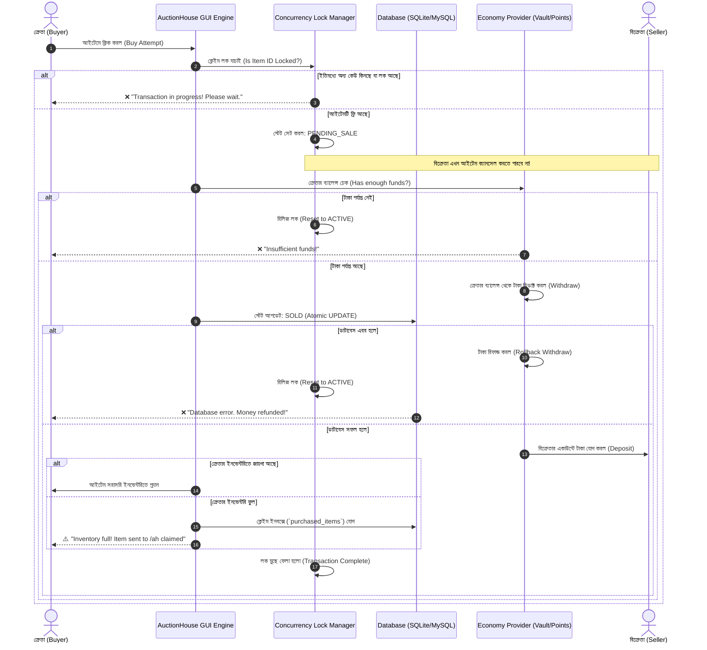

# 🏛️ Ultimate AuctionHouse Plugin: Complete Architectural Design & Feature Blueprint

> **প্রকল্প:** কাস্টম মডার্ন, হাই-পারফরম্যান্স এবং ডুপ-প্রুফ (Dupe-Proof) Minecraft AuctionHouse প্লাগিন  
> **বিশ্লেষিত ডেমো প্লাগিনসমূহ:**
> 1. **Demo Auction 1:** `Auction` by `elivb` (v1.8)
> 2. **Demo Auction 2:** `DonutAuctionHouse` by `NightBeam Studio` (v1.5.0)
> 3. **Demo Auction 3:** `zAuctionHouse` by `Maxlego08` (v4.0.1.3)
>
> **লক্ষ্য:** তিনটি প্লাগিনের শক্তি ও দুর্বলতা বিচার করে সবচেয়ে সেরা ও নিখুঁত একটি AuctionHouse তৈরি করার রূপরেখা।

---

## 📑 সূচিপত্র (Table of Contents)
1. [নির্বাহী সারসংক্ষেপ ও রূপকল্প (Executive Summary)](#1-নির্বাহী-সারসংক্ষেপ-ও-রূপকল্প-executive-summary)
2. [তিনটি ডেমো প্লাগিনের চুলচেরা বিশ্লেষণ ও ভালো দিকসমূহ (Strengths of the 3 Plugins)](#2-তিনটি-ডেমো-প্লাগিনের-চুলচেরা-বিশ্লেষণ-ও-ভালো-দিকসমূহ-strengths-of-the-3-plugins)
3. [নতুন প্লাগিনে কী কী থাকবে / অবশ্যই রাখা উচিত (Features to Include)](#3-নতুন-প্লাগিনে-কী-কী-থাকবে--অবশ্যই-রাখা-উচিত-features-to-include)
4. [কী কী রাখবেন না / যা বর্জন করা উচিত (What NOT to Include & Critical Mistakes)](#4-কী-কী-রাখবেন-না--যা-বর্জন-করা-উচিত-what-not-to-include--critical-mistakes)
5. [১০০% ডুপ-প্রুফ সেফটি ও ট্রানজেকশন আর্কিটেকচার (Anti-Dupe & Concurrency Engine)](#5-১০০-ডুপ-প্রুফ-সেফটি-ও-ট্রানজেকশন-আর্কিটেকচার-anti-dupe--concurrency-engine)
6. [মাল্টি-ইকোনমি ও কারেন্সি ইঞ্জিন (Multi-Economy System)](#6-মাল্টি-ইকোনমি-ও-কারেন্সি-ইঞ্জিন-multi-economy-system)
7. [GUI ও ইউজার ইন্টারফেস ডিজাইন (Modern UI/UX Blueprint)](#7-gui-ও-ইউজার-ইন্টারফেস-ডিজাইন-modern-uiux-blueprint)
8. [আইটেম রুল ও অ্যাডভান্সড ক্যাটাগরি সিস্টেম (Rules & Custom Item Support)](#8-আইটেম-রুল-ও-অ্যাডভান্সড-ক্যাটাগরি-সিস্টেম-rules--custom-item-support)
9. [ক্রস-সার্ভার সিনক্রোনাইজেশন ও নেটওয়ার্ক সাপোর্ট (Cross-Server & Folia)](#9-ক্রস-সার্ভার-সিনক্রোনাইজেশন-ও-নেটওয়ার্ক-সাপোর্ট-cross-server--folia)
10. [ডিসকর্ড ওয়েবহুক ও বাহ্যিক ইন্টিগ্রেশন (Discord Webhook Integration)](#10-ডিসকর্ড-ওয়েবহুক-ও-বাহ্যিক-ইন্টিগ্রেশন-discord-webhook-integration)
11. [প্রস্তাবিত কনফিগারেশন ফাইল স্ট্রাকচার (Config File Architecture)](#11-প্রস্তাবিত-কনফিগারেশন-ফাইল-স্ট্রাকচার-config-file-architecture)
12. [ডাটাবেস স্কিমা ডিজাইন (Database Schema)](#12-ডাটাবেস-স্কিমা-ডিজাইন-database-schema)
13. [ধাপে ধাপে ডেভেলপমেন্ট রোডম্যাপ (Implementation Roadmap)](#13-ধাপে-ধাপে-ডেভেলপমেন্ট-রোডম্যাপ-implementation-roadmap)

---

## 1. নির্বাহী সারসংক্ষেপ ও রূপকল্প (Executive Summary)

একটি সাধারণ AuctionHouse প্লাগিনের প্রধান সমস্যাগুলো হলো:
* প্লেয়ারদের ডুপ্লিকেট গ্লিচ (Dupe Glitch) বের করা (ইনভেন্টরি ফুল থাকা অবস্থায় বা একই সাথে দুইজন ক্লিক করলে)।
* অনেক আইটেম লিস্টিং হলে সার্ভার ল্যাগ ও TPS ড্রপ করা।
* শুধু একক ইকোনমি (Vault) সাপোর্ট থাকা।
* দেখতে ব্যাকডেটেড ও কাস্টমাইজেশন জটিল হওয়া।
* বড় নেটওয়ার্কে সার্ভার টু সার্ভার দ্রুত ডাটা সিঙ্ক না হওয়া।

আমরা যে নতুন প্লাগিনটি ডিজাইন করব, তা হবে:
* **লাইটওয়েট ও সুপার-ফাস্ট:** Folia ও Paper-এর অ্যাসিঙ্ক্রোনাস আর্কিটেকচার ব্যবহার করে তৈরি।
* **ডুপ-প্রুফ ইনবক্স আর্কিটেকচার:** কোনো পরিস্থিতিতেই আইটেম মাটিতে পড়বে না বা ডুপ হবে না।
* **হাইব্রিড ভিজ্যুয়াল:** Demo 1-এর প্রিমিয়াম মিনিমালিস্টিক স্টাইল + Demo 3-এর গভীর কনফিগারিবিলিটি।
* **মাল্টি-ইকোনমি:** টাকা, পয়েন্ট, লেভেল এবং সরাসরি **আইটেম কারেন্সি** (যেমন: Diamonds, Netherite) সাপোর্ট।

---

## 2. তিনটি ডেমো প্লাগিনের চুলচেরা বিশ্লেষণ ও ভালো দিকসমূহ (Strengths of the 3 Plugins)

| বৈশিষ্ট্য | Demo 1: Auction (elivb) | Demo 2: DonutAuctionHouse | Demo 3: zAuctionHouse (v4) |
| :--- | :--- | :--- | :--- |
| **আর্কিটেকচার ফোকাস** | লাইটওয়েট, ক্লিন লুক ও ইজি GUI | DonutSMP স্টাইল, কমপিটিটিভ ও কমপ্যাক্ট | এন্টারপ্রাইজ গ্রেড, অল-ইন-ওয়ান ফিচার প্যাক |
| **GUI ভিজ্যুয়াল** | আধুনিক হেক্স কালার ও SmallCaps ফন্ট | মিনিমালিস্টিক ডোনাট স্টাইল | অত্যন্ত কাস্টমাইজযোগ্য তবে জটিল |
| **ডুপ প্রোটেকশন** | বেসিক | মিডিয়াম (পেন্ডিং ক্লেইম লক) | অসাধারণ (Claim Inbox + Purchase Lock) |
| **ইকোনমি ভ্যারাইটি** | শুধু Vault | Vault + VaultUnlocked | Vault, Points, CoinsEngine, Items, EXP |
| **মাল্টি-সার্ভার সিঙ্ক** | নেই | SQLite, MySQL + Redis Pub/Sub | SQLite, MySQL/MariaDB |
| **ক্যাটাগরি ও রুলস** | হার্ডকোডেড ৮টি ক্যাটাগরি | বেসিক ফিল্টার | ম্যাটেরিয়াল, ট্যাগ, CustomModelData, রেজেক্স |
| **শুলকার বক্স ভিউ** | বিল্ট-ইন ডেডিকেটেড GUI | বেসিক প্রিভিউ | ডেডিকেটেড কন্টেন্ট ভিউয়ার |
| **পারফরম্যান্স মনিটরিং** | নেই | নেই | বিল্ট-ইন পারফরম্যান্স প্রোফাইলার |

### ক) Demo Auction 1-এর সেরা দিকগুলো (Best Aspects of Demo 1):
1. **শুলকার বক্স ইন্সপেকশন GUI (`shulker.view.gui.yml`):** প্লেয়াররা না কিনে সরাসরি মেনু থেকেই শুলকারের ভেতরে কী কী আইটেম আছে দেখতে পারে। এটি ট্রেডিং স্ক্যাম সম্পূর্ণরূপে বন্ধ করে।
2. **আর্থিক পরিসংখ্যান (`transactions.gui.yml`):** প্লেয়ার কত খরচ করেছে (`Total Spent`) এবং কত আয় করেছে (`Total Made`) তা সরাসরি দেখার জন্য সুন্দর বুক মেনু।
3. **ফাস্ট-বাই ও ফাস্ট-সেল (`/ahfastbuytoggle`, `/ahfastselltoggle`):** অভিজ্ঞ ও প্রো প্লেয়ারদের বারবার কনফার্মেশন মেনুতে না পাঠিয়ে এক ক্লিকেই কেনাবেচার সুবিধা।
4. **Sign GUI / Chat Search ইনপুট:** প্লেয়াররা সাইন বা চ্যাটে টাইপ করে সরাসরি আইটেম বা প্লেয়ার সার্চ করতে পারে।
5. **চ্যাট ব্রডকাস্ট:** কোনো দামি বা নতুন আইটেম অকশনে দিলে চ্যাটে সুন্দর হেক্স ফরম্যাটে ব্রডকাস্ট হওয়া।
6. **`/ah view <player>`:** নির্দিষ্ট কোনো প্লেয়ারের দেওয়া সব লিস্টিং এক ক্লিকে দেখা।

### খ) Demo Auction 2-এর সেরা দিকগুলো (Best Aspects of Demo 2):
1. **MySQL + Redis ক্রস-সার্ভার রিয়েলটাইম সিঙ্ক:** একটি সার্ভারে আইটেম লিস্টিং করলে সাথে সাথে অন্য সার্ভারে নোটিফিকেশন যায় এবং ডাটাবেসের কনকারেন্সি লক নিশ্চিত করে।
2. **পেন্ডিং সেল ট্র্যাকিং (`pending-sales` debug):** ট্রানজেকশনের সময় রেস-কন্ডিশন চেক করে যাতে দুজন এক সাথে ক্লিক করলে টাকা কাটার পরেও আইটেম না হারিয়ে যায়।
3. **পারমিশন-বেসড লিস্টিং লিমিট ও স্লট এক্সপেনশন:**
   - লিস্টিং লিমিট: `donutauction.limit.5`, `donutauction.limit.25`, `donutauction.limit.unlimited`।
   - স্লট আনলক পারমিশন: র‍্যাংক অনুযায়ী প্লেয়াররা বেশি আইটেম লিস্টিং করার স্লট পায়।
4. **ক্লিন লোর অ্যাপেন্ডার (Lore Append Mode):** আইটেমের আগের লোর নষ্ট না করে সেপারেটর লাইন (`---`) দিয়ে অকশনের প্রাইস ও সেলারের নাম সুন্দরভাবে যোগ করা।
5. **Paper / Folia কমপ্যাটিবিলিটি:** রিজিওনাল মাল্টিথ্রেডেড সার্ভারে কোনো ক্র্যাশ ছাড়াই চলার উপযোগী আর্কিটেকচার।

### গ) Demo Auction 3-এর সেরা দিকগুলো (Best Aspects of Demo 3):
1. **সেফ ইনবক্স আর্কিটেকচার (`PURCHASED_ITEMS` ও `EXPIRED_ITEMS`):** আইটেম কেনার পর বা অকশন শেষ হয়ে গেলে প্লেয়ারের ইনভেন্টরিতে সরাসরি না দিয়ে একটি আলাদা ইনবক্সে জমা থাকে। প্লেয়ার ফাঁকা ইনভেন্টরি নিয়ে যখন ইচ্ছা রিট্রিভ করতে পারে।
2. **`being-purchased-item` লক স্টেট:** যখন একজন প্লেয়ার কোনো আইটেমের কনফার্মেশন স্ক্রিনে থাকে, তখন মূল অকশন হাউসে সেই আইটেমটি লক হয়ে যায়, ফলে সেলার সেটি ক্যানসেল করতে পারে না এবং অন্য কেউ একযোগে কিনতে পারে না।
3. **মাল্টি-ইকোনমি সিস্টেম (`economies.yml`):** শুধু সার্ভার কারেন্সি নয়; প্লেয়ার পয়েন্ট, লেভেল, এক্সপি এমনকি **আইটেম (যেমন ডায়মন্ড বা কাস্টম কয়েন)** কারেন্সি হিসেবে ব্যবহার করে অকশন চালানো যায়।
4. **অ্যাডভান্সড রুল ইঞ্জিন (`rules.yml`):**
   - Material, Material Suffix (যেমন: `_SWORD`, `_HELMET`)
   - Bukkit/Paper Item Tags (`tag: BLOCKS`, `tag: ITEMS`)
   - Custom Model Data (কাস্টম টেক্সচার প্যাকের আইটেম ফিল্টার করা)
   - কাস্টম প্লাগিন সাপোর্ট: **ItemsAdder, Oraxen, Nexo, MMOItems**
5. **ইন-মেমরি ক্যাশ ও পারফরম্যান্স প্রোফাইলার (`enable-performance-debug`):** ৫,০০০+ লিস্টিং থাকলেও `SortedItemsCache` ব্যবহার করে мгновенно (ইনস্ট্যান্টলি) সর্ট ও পেজিনেশন করা যায়।
6. **প্রাইস শর্টকাট মাল্টিপ্লায়ার:** প্লেয়ারদের বড় সংখ্যা লিখতে হয় না, সরাসরি `10k`, `2.5m`, `1b` টাইপ করলেই অটো ক্যালকুলেট হয়।

---

## 3. নতুন প্লাগিনে কী কী থাকবে / অবশ্যই রাখা উচিত (Features to Include)

নিচে আপনার নতুন প্লাগিনের জন্য চূড়ান্ত ফিচার তালিকা ক্যাটাগরি অনুযায়ী সাজিয়ে দেওয়া হলো:

```
[ Ultimate AuctionHouse Features ]
├── 1. Core Engine: Folia-ready, Paper Asynchronous Scheduler, HikariCP Connection Pool
├── 2. Storage: SQLite (Default/Local) + MySQL/MariaDB (Cross-Server) + Redis Pub/Sub
├── 3. Dupe Protection: Two-Phase Commit Lock + "Claim Inbox" System (Zero-Drop)
├── 4. Economy: Vault, PlayerPoints, CoinsEngine, EXP/Levels, Item-As-Currency (Diamonds)
├── 5. GUI Experience: Standalone Custom GUI (No zMenu dep), MiniMessage & Hex, Shulker View
├── 6. UX Enhancements: FastBuy/FastSell, /ah sell Interactive GUI, Price Multipliers (1k, 1m)
├── 7. Filter & Search: Full Anvil/Sign/Chat Search, Deep Categories with CustomModelData
├── 8. Statistics & History: Total Spent/Earned, Detailed Logs, Offline Sales Notification
└── 9. Social & Discord: Embed Webhooks with Dynamic Minecraft Item Head/Texture API
```

### A. কোর আর্কিটেকচার ও পারফরম্যান্স
1. **Folia ও Paper নেটিভ আর্কিটেকচার:**
   - বর্তমান এবং ভবিষ্যৎ Minecraft সার্ভারের জন্য Folia (রিজিওনাল থ্রেডিং) সাপোর্ট বাধ্যতামূলক।
   - ডাটাবেস কোয়েরি, ডিসকর্ড ওয়েব রিকোয়েস্ট এবং ক্যাশ প্রসেসিং কখনোই মেইন সার্ভার টিক থ্রেডে চলবে না।
2. **হাইব্রিড স্টোরেজ ইঞ্জিন:**
   - ছোট সার্ভারের জন্য: এক ক্লিকে জিরো-সেটআপ `SQLite`।
   - বড় নেটওয়ার্কের জন্য: হাই-পারফরম্যান্স `MySQL / MariaDB` কানেকশন পুল (HikariCP)।
3. **মেমরি ক্যাশ ও ফাস্ট সর্টিং (`SortedItemsCache`):**
   - প্রতিবার প্লেয়ার মেনু ওপেন করলে ডাটাবেসে রিকোয়েস্ট যাবে না। ডাটা র‍্যামে ক্যাশ থাকবে।
   - সর্টিং মোড: Lowest Price, Highest Price, Recently Listed, Expiring Soon, Alphabetical (A-Z)।

### B. ডুপ-প্রুফ সেফটি মেকানিজম (Zero-Dupe Guarantee)
1. **ক্লেইম ইনবক্স ড্রাইভেন ডেলিভারি (Inbox Delivery):**
   - কোনো আইটেম কেনার পর বা মেয়াদ শেষ হলে ড্রপ হয়ে মাটিতে পড়বে না।
   - প্লেয়ারের ইনভেন্টরিতে জায়গা থাকলে অটোমেটিক যাবে, আর জায়গা না থাকলে সরাসরি `/ah claimed` বা `/ah expired` ইনবক্সে জমা হবে।
2. **ট্রানজেকশন স্টেট ও কনকারেন্সি লক (Lock-on-Intent):**
   - প্লেয়ার ১ যখন "Buy" ক্লিক করে কনফার্মেশন স্ক্রিনে যাবে, আইটেমটির স্টেট হবে `PENDING_SALE`।
   - এই সময়ে প্লেয়ার ২ যদি ক্লিক করে, তাকে বলবে: *"Item is currently being processed."*
   - বিক্রেতাও এই সময়ে আইটেমটি ক্যানসেল বা ফেরত নিতে পারবে না।
3. **পারমাণবিক (Atomic) লেনদেন:**
   - আগে ক্রেতার থেকে টাকা কাটা হবে, তারপর ডাটাবেসে আইটেম স্ট্যাটাস `SOLD` হবে, তারপর বিক্রেতার একাউন্টে টাকা জমা হবে এবং ক্রেতার ইনবক্সে আইটেম যাবে। এর কোনো একটি ধাপ ফেইল করলে সম্পূর্ণ ট্রানজেকশন অটোমেটিক রোলব্যাক (Rollback) হবে।

### C. মাল্টি-ইকোনমি ও কারেন্সি ফ্লেক্সিবিলিটি
1. **ভল্ট এবং ভল্টআনলকড (Vault & VaultUnlocked):** স্ট্যান্ডার্ড সার্ভার মানি।
2. **সেকেন্ডারি প্লাগিন কারেন্সি:** PlayerPoints, CoinsEngine, UltraEconomy, TokenManager।
3. **আইটেম কারেন্সি (Item Currency):**
   - প্লেয়াররা ডায়মন্ড, এমারেল্ড, নেদারাইট ইনগট বা কাস্টম কারেন্সি টোকেন দিয়ে বেচাকেনা করতে পারবে (যেমন: `/ah sell 10 DIAMOND`)।
4. **ট্যাক্স (Tax / Listing Fee):**
   - লিস্টিং ট্যাক্স (লিস্ট করার সময় কাটা হবে) এবং সেলস ট্যাক্স (বিক্রি হওয়ার পর শতাংশ কাটা হবে)।
   - পারমিশন অনুযায়ী ভিআইপি প্লেয়ারদের জন্য ট্যাক্স ছাড় (Tax Discount) সুবিধা।

### D. আধুনিক GUI ও ইউজার এক্সপেরিয়েন্স
1. **স্ট্যান্ডঅ্যালোন কাস্টম GUI ইঞ্জিন:**
   - কোনো থার্ড পার্টি প্লাগিন (যেমন zMenu) ছাড়াই চলবে। নিজের ভেতরেই লাইটওয়েট, বাগ-মুক্ত ইনভেন্টরি হ্যান্ডলার থাকবে।
2. **শুলকার বক্স ইন্সপেকশন ভিউ:**
   - শুলকার বক্সে রাইট ক্লিক করলে তার ভেতরের ২৭টি স্লট সুন্দর একটি পপ-আপ প্রিভিউ GUI-তে দেখাবে।
3. **ফাস্ট-বাই ও ফাস্ট-সেল টগল:**
   - প্রো প্লেয়াররা বারবার কনফার্মেশন ডায়ালগে ক্লিক করতে চায় না। কমান্ড বা সেটিংস থেকে টগল চালু থাকলে এক ক্লিকেই বাই/সেল হবে।
4. **ইন্টারেক্টিভ `/ah sell` GUI:**
   - যারা কমান্ড দিয়ে দাম লিখতে পছন্দ করে না, তারা শুধু `/ah sell` লিখলে একটি মেনু খুলবে। সেখানে হাত থেকে আইটেম রেখে বাটন টিপে দাম, কারেন্সি এবং মেয়াদ ঠিক করে সরাসরি লিস্টিং কনফার্ম করা যাবে।
5. **সার্চ অপশন:**
   - Sign GUI, Anvil GUI অথবা চ্যাটে সার্চ করার সুবিধা।
   - আইটেমের নাম, লোর অথবা বিক্রেতার নাম দিয়ে সার্চ।
6. **প্রাইস শর্টকাট ইনপুট:**
   - `500k`, `1.5m`, `10b` লিখলে স্বয়ংক্রিয়ভাবে পূর্ণ সংখ্যা তৈরি করা।

### E. পরিসংখ্যান, হিস্ট্রি ও অফলাইন নোটিফিকেশন
1. **হিস্ট্রি ও অ্যানালিটিক্স মেনু (`/ah history`):**
   - প্লেয়ারের বিগত ৫০টি কেনাবেচার পূর্ণ হিস্ট্রি (কখন, কার কাছ থেকে, কত দামে কেনা হয়েছে)।
   - `Total Money Spent` এবং `Total Money Earned` প্রদর্শন।
2. **অফলাইন সেলস নোটিফিকেশন:**
   - প্লেয়ার অফলাইনে থাকা অবস্থায় তার আইটেম বিক্রি হলে সে যখনই আবার সার্ভারে ঢুকবে, চমৎকার সাউন্ড সহ চ্যাট ও অ্যাকশনবারে নোটিফিকেশন দেখাবে: *"While you were away, PlayerX bought your item for $50,000!"*

### F. কাস্টম আইটেম ও রুলস ইঞ্জিন
1. **মডার্ন কাস্টম আইটেম সাপোর্ট:**
   - ItemsAdder, Oraxen, Nexo, MMOItems এর কাস্টম ফার্নিচার, অস্ত্র এবং আর্মার নিখুঁতভাবে নাম ও টেক্সচার সহ রেন্ডার হওয়া।
2. **ব্ল্যাকলিস্ট ও রুলস:**
   - নির্দিষ্ট আইটেম (যেমন: Bedrock, Barrier, কমান্ড ব্লক) অকশনে দেওয়া বন্ধ রাখা।
   - লোর-বেসড ব্লক (যেমন: লোরের মধ্যে যদি `Soulbound` বা `Untradeable` লেখা থাকে তবে তা বিক্রি করা যাবে না)।
   - প্রাইস ক্যাপ (মিনিমাম ও ম্যাক্সিমাম প্রাইস লিমিট যাতে ইকোনমি ধ্বংস না হয়)।

---

## 4. কী কী রাখবেন না / যা বর্জন করা উচিত (What NOT to Include & Critical Mistakes)

নতুন প্লাগিন বানানোর সময় নিচের ভুলগুলো **কখনোই করবেন না**:

| বিষয় | কেন রাখবেন না? | সমাধান / বিকল্প ব্যবস্থা |
| :--- | :--- | :--- |
| **হার্ডকোডেড লাইসেন্স বা DRM (Demo 1-এর মত)** | Demo 1-এ `LicenseManager.class` এবং ডিসকর্ড লাইসেন্সিং সিস্টেম রয়েছে। দূরবর্তী সার্ভার ডাউন হলে বা লোকালহোস্টে টেস্ট করলে প্লাগিন বন্ধ হয়ে যায়। এটি কোড ভারী করে এবং নিরাপত্তা ঝুঁকি বাড়ায়। | সম্পূর্ণ ওপেন ও সেলফ-কনটেইন্ড আর্কিটেকচার। কোনো হিডেন নেটওয়ার্ক কল বা DRM থাকবে না। |
| **এক্সটার্নাল GUI ফ্রেমওয়ার্কের ওপর হার্ড ডিপেন্ডেন্সি (Demo 3-এর zMenu)** | Demo 3 নিজে চলতে পারে না, আলাদা zMenu প্লাগিন ইন্সটল করতে হয়। এতে কনফ্লিক্ট তৈরি হয় এবং ইউজারদের সেটআপ করতে বিরক্ত লাগে। | নিজস্ব লাইটওয়েট স্ট্যান্ডঅ্যালোন GUI ম্যানেজার তৈরি করা। কোনো বহিরাগত মেনু প্লাগিনের ওপর নির্ভরশীল না হওয়া। |
| **মাটিতে আইটেম ড্রপ করা (Drop on Ground)** | ইনভেন্টরি ফুল হলে আইটেম নিচে ফেলে দিলে হ্যাকড ক্লায়েন্টের ম্যাগনেট বা অন্যান্য প্লেয়ার দ্রুত তুলে নেয় এবং সার্ভার ডিসকানেক্টের সাথে ডুপের সুযোগ তৈরি হয়। | **জিরো-ড্রপ পলিসি (Zero-Drop Policy):** কখনো মাটিতে ফেলা যাবে না, সরাসরি ক্লেইম ইনবক্সে পাঠাতে হবে। |
| **মেইন থ্রেডে ডাটাবেস অপারেশন** | SQLite বা MySQL কোয়েরি মেইন থ্রেডে রান করলে সার্ভার ১-২ সেকেন্ডের জন্য ফ্রিজ (TPS Drop) হয়ে যায়। | সর্বদাই **Async Tasks (`CompletableFuture`)** এবং HikariCP ব্যবহার করতে হবে। |
| **ইনকমপ্লিট / আন-ইমপ্লিমেন্টেড ফিচার স্টাব (Stub features)** | Demo 3-তে Renting এবং Bidding-এর কনফিগ কোড রেখে দেওয়া হয়েছে যা কাজ করে না। এতে সাধারণ সার্ভার ওনাররা কনফিউজড হয়ে যান। | কনফিগে কেবল সেটাই থাকবে যা বাস্তবিক অর্থে ১০০% কার্যকর। কোনো অপূর্ণ ডামি কোড রাখা যাবে না। |
| **পুরাতন `&` কালার কোড নির্ভরতা** | আধুনিক মাইনক্রাফটে লেগ্যাসি কোড (`&a`, `&6`) টেক্সটের আধুনিক বৈশিষ্ট্য নষ্ট করে। | আধুনিক **Kyori Adventure MiniMessage** (`<gradient>`, `<hover>`, `<click>`) ব্যবহার করতে হবে। |

---

## 5. ১০০% ডুপ-প্রুফ সেফটি ও ট্রানজেকশন আর্কিটেকচার (Anti-Dupe & Concurrency Engine)

মাইনক্রাফট অকশন হাউসের সবচেয়ে বড় শত্রু হলো **Duplication Glitch** এবং **Transaction Race Conditions**। নিচে আমাদের প্লাগিনের নিরাপদ ট্রানজেকশন প্রোটোকল দেখানো হলো:



### প্রধান ৩টি নিরাপত্তা নিয়মাবলী:
1. **Row-Level Concurrency Locking:** কোনো আইটেমের লেনদেন চলাকালীন মেমোরি ও ডাটাবেসে তার আইডি লক থাকবে।
2. **Two-Phase Commit:** টাকা কাটা এবং আইটেম ট্রান্সফার একক পারমাণবিক (Atomic) চেইনে সম্পন্ন হবে। মাঝামাঝি কোনো এরর হলে স্বয়ংক্রিয় রিফান্ড।
3. **Safe Claim Inbox:** ইনভেন্টরি ফুল থাকা বা নেটওয়ার্ক ড্রপ হওয়ার মুহূর্তে আইটেম কখনো উধাও বা মাটিতে পড়বে না, ডাটাবেসের `purchased_items` টেবিলে সুরক্ষিত থাকবে।

---

## 6. মাল্টি-ইকোনমি ও কারেন্সি ইঞ্জিন (Multi-Economy System)

প্লেয়াররা কেবল সাধারণ ভল্ট ডলার নয়, যেকোনো কারেন্সিতে তাদের আইটেম বেচাকেনা করতে পারবে।

```
        ┌────────────────────────────────────────────────────────┐
        │               Unified Economy Router                   │
        └──────────────────────────┬─────────────────────────────┘
                                   │
       ┌─────────────────┬─────────┴─────────┬──────────────────┐
       ▼                 ▼                   ▼                  ▼
┌─────────────┐   ┌─────────────┐    ┌───────────────┐   ┌──────────────┐
│    Vault    │   │PlayerPoints │    │  CoinsEngine  │   │ Item-Economy │
│ (Standard)  │   │  / Tokens   │    │  Custom Coin  │   │(Diamond/Gold)│
└─────────────┘   └─────────────┘    └───────────────┘   └──────────────┘
```

* **স্বাভাবিক কারেন্সি:** Vault (EssentialsX, CMI), PlayerPoints, CoinsEngine।
* **এক্সপেরিয়েন্স কারেন্সি:** প্লেয়ার চাইলে এক্সপি পয়েন্ট বা এক্সপি লেভেল দিয়ে আইটেম কিনতে/বেচতে পারবে।
* **আইটেম-বেসড কারেন্সি (Vanilla Trade Friendly):**
  - অনেক সার্ভারে ভ্যানিলা অনুভূতি বজায় রাখতে ডলারের বদলে হীরা (Diamonds) বা এমারেল্ড (Emeralds) দিয়ে ট্রেড করা হয়।
  - প্লাগিন সরাসরি প্লেয়ারের ইনভেন্টরি থেকে ডায়মন্ড চেক করে কেটে নেবে এবং বিক্রেতার কাছে পৌঁছে দেবে।
* **ট্যাক্স কনফিগারেশন:**
  - প্রতিটি কারেন্সির জন্য আলাদা মিনিমাম ও ম্যাক্সিমাম মূল্য নির্ধারণ করা যাবে।
  - প্রতিটি কারেন্সিতে আলাদা পার্সেন্টেজ সেলস ট্যাক্স সেট করা যাবে।

---

## 7. GUI ও ইউজার ইন্টারফেস ডিজাইন (Modern UI/UX Blueprint)

প্লাগিনের প্রধান রূপ হবে আধুনিক, মার্জিত এবং প্রিমিয়াম লুকিং।

### ক) মেইন অকশন ব্রাউজার (`main_gui.yml`)
* **সাইজ:** ৫৪ স্লট (৬ সারি)।
* **স্লট ০ থেকে ৪৪ (৪৫টি স্লট):** অকশন লিস্টিং আইটেম দেখানোর স্থান।
* **নিচের কন্ট্রোল প্যানেল (স্লট ৪৫-৫৩):**
  - `Slot 45:` ◀ পূর্ববর্তী পৃষ্ঠা (Previous Page)
  - `Slot 46:` 📊 ক্যাটাগরি মেনু (Categories Filter)
  - `Slot 47:` 🔄 সর্টিং অপশন (Sort: High/Low Price, Newest)
  - `Slot 48:` 🔍 সার্চ ফিল্টার (Search by Item/Player)
  - `Slot 49:` 🔄 রিফ্রেশ বাটন (Refresh Listing)
  - `Slot 50:` 📦 শুলকার কন্টেন্ট ভিউয়ার (Shulker Inspection Info)
  - `Slot 51:` 🎒 আমার আইটেমসমূহ (My Selling Items & History)
  - `Slot 52:` 📥 ক্লেইম ইনবক্স (Claim Expired / Purchased Items)
  - `Slot 53:` ▶ পরবর্তী পৃষ্ঠা (Next Page)

### খ) প্রিমিয়াম লোর ফরম্যাট (Lore Preview Format)
মডেল আইটেমের আসল নাম ও এনচ্যান্ট লোরের নিচে একটি মার্জিত সেপারেটর দিয়ে নিচের ইনফো যুক্ত হবে:

```
+----------------------------------------------------+
|  Netherite Sword                                   |
|  Sharpness V                                       |
|  Unbreaking III                                    |
|  ------------------------------------------------  |
|  🏷️ বিক্রেতা :  Steve                                |
|  💰 মূল্য   :  $25,000 (Vault)                      |
|  ⏱️ বাকি সময় :  23 ঘণ্টা 45 মিনিট                   |
|                                                    |
|  ▶ বাম ক্লিক  :  কিনতে ক্লিক করুন                   |
|  ▶ শিফট ক্লিক :  শুলকার/বিস্তারিত দেখুন (প্রযোজ্য ক্ষেত্রে) |
+----------------------------------------------------+
```

### গ) ইন্টারেক্টিভ সেল মেনু (`/ah sell` GUI)
প্লেয়ার কমান্ডে ভুল সংখ্যা যাতে না লেখে, সেজন্য চমৎকার একটি GUI থাকবে:
* মাঝখানে প্লেয়ার তার আইটেম রাখবে।
* ডানে ও বামে বোতাম থাকবে: `+100`, `+1k`, `+10k`, `+100k`, `-100`, `-1k` ইত্যাদি।
* কারেন্সি সিলেক্টর ড্রপডাউন থাকবে (Vault / Diamonds / Points)।
* সম্ভাব্য ট্যাক্স কেটে প্লেয়ার নিট কত টাকা পাবে তার লাইভ প্রিভিউ থাকবে।

---

## 8. আইটেম রুল ও অ্যাডভান্সড ক্যাটাগরি সিস্টেম (Rules & Custom Item Support)

Demo 3-এর সবচেয়ে ভালো দিক ছিল এর রুলস ইঞ্জিন। আমরা এটিকে আরও সহজে ব্যবহারযোগ্য করব:

### ক) ফিল্টারিং ক্রাইটেরিয়া
* **ম্যাটেরিয়াল ফিল্টার:** `DIAMOND_SWORD`, `NETHERITE_CHESTPLATE` ইত্যাদি।
* **ওয়াইল্ডকার্ড/সাফিক্স ফিল্টার:** `*_HELMET`, `*_BOOTS`, `*_AXE` (সব আর্মার এক ক্লিকে ধরা)।
* **Vanilla Tags:** `#minecraft:swords`, `#minecraft:planks`, `#minecraft:pickaxes`।
* **কাস্টম মডেল ডাটা (CustomModelData):** কাস্টম আইটেমের আইডির উপর ভিত্তি করে ক্যাটাগরি তৈরি।
* **কাস্টম প্লাগিন কম্প্যাটিবিলিটি:**
  - `ItemsAdder:itemsadder_item_id`
  - `Oraxen:oraxen_item_id`
  - `Nexo:nexo_item_id`
  - `MMOItems:TYPE.ID`

### খ) ব্ল্যাকলিস্ট ও প্রাইস রেগুলেশন
* সার্ভারের অর্থনীতি সুস্থ রাখতে নির্দিষ্ট আইটেমের সর্বনিম্ন এবং সর্বোচ্চ মূল্য নির্ধারণ করা যাবে:
  - উদাহরণ: ডায়মন্ডের দাম $100 এর নিচে এবং $10,000 এর উপরে লিস্টিং করা যাবে না।
* আনট্রেডেবল আইটেম ফিল্টার: আইটেমের লোরে যদি নির্দিষ্ট টেক্সট থাকে (যেমন: `Untradeable`, `Soulbound`), প্লাগিন স্বয়ংক্রিয়ভাবে লিস্টিং ব্লক করবে।

---

## 9. ক্রস-সার্ভার সিনক্রোনাইজেশন ও নেটওয়ার্ক সাপোর্ট (Cross-Server & Folia)

বড় বাঞ্জিকর্ড/ভেলোসিটি (BungeeCord / Velocity) নেটওয়ার্কের জন্য:

```
[ Survival Server 1 ]          [ Survival Server 2 ]          [ Skyblock Server ]
         │                              │                              │
         ▼                              ▼                              ▼
  ┌──────────────┐               ┌──────────────┐               ┌──────────────┐
  │ Local Memory │               │ Local Memory │               │ Local Memory │
  └──────┬───────┘               └──────┬───────┘               └──────┬───────┘
         │                              │                              │
         ├──────────────────────────────┼──────────────────────────────┤
         ▼                              ▼                              ▼
┌──────────────────────────────────────────────────────────────────────────────┐
│                         Central MySQL / MariaDB                              │
│             (সকল সার্ভারের আইটেম ও ক্লেইমের কেন্দ্রীয় সত্য উৎস)               │
└──────────────────────────────────────┬───────────────────────────────────────┘
                                       │
                                       ▼
┌──────────────────────────────────────────────────────────────────────────────┐
│                             Redis Pub/Sub Bus                                │
│       (সার্ভারগুলোতে ইনস্ট্যান্ট নতুন লিস্টিং ও ক্রয় ব্রডকাস্ট পাঠায়)           │
└──────────────────────────────────────────────────────────────────────────────┘
```

1. **MySQL/MariaDB:** কেন্দ্রীয় ডাটাবেস যা সব সার্ভার শেয়ার করবে।
2. **Redis Pub/Sub:**
   - যখন সার্ভার ১-এ একজন প্লেয়ার আইটেম বিক্রি করবে, রেডিস একটি ছোট্ট প্যাকেট পাঠাবে।
   - সার্ভার ২ এবং সার্ভার ৩ পল (Poll) না করেই ১ মিলি-সেকেন্ডে তাদের লোকাল ক্যাশ আপডেট করে নেবে। ফলে ব্যান্ডউইথ বাঁচে এবং ল্যাগ হয় না।
3. **Folia Scheduler:**
   - বাকেট বা স্পিগটের পুরাতন `Bukkit.getScheduler()` এর পরিবর্তে `GlobalRegionScheduler` এবং `EntityScheduler` ব্যবহার করতে হবে যাতে Folia সার্ভারে মাল্টি-থ্রেডিংয়ে ক্র্যাশ না হয়।

---

## 10. ডিসকর্ড ওয়েবহুক ও বাহ্যিক ইন্টিগ্রেশন (Discord Webhook Integration)

ডিসকর্ডে স্বয়ংক্রিয়ভাবে অকশনের খবর জানানোর জন্য উন্নত ওয়েব-হুক ইঞ্জিন:

* **লিস্টিং ইভেন্ট (Listing Event):** নতুন কোনো আইটেম অকশনে উঠলে সুন্দর এম্বেড তৈরি হবে।
* **পারচেজ ইভেন্ট (Purchase Event):** আইটেম বিক্রি হলে ক্রেতা ও বিক্রেতার নাম সহ নোটিফিকেশন।
* **আইটেম প্রিভিউ ইমেজ:**
  - সাধারণ ভ্যানিলা আইটেমের জন্য পাবলিক বা নিজস্ব API থেকে আইটেমের স্বচ্ছ PNG ছবি এমবেড থাম্বনেইলে দেখানো হবে:  
    `https://assets.mc-icons.com/items/%item_material%.png`
* **ডায়নামিক কালার:** আইটেমের বিরলতা (Rarity - Common, Rare, Epic, Legendary) অনুযায়ী এম্বেডের বর্ডার কালার অটো পরিবর্তন হবে।

---

## 11. প্রস্তাবিত কনফিগারেশন ফাইল স্ট্রাকচার (Config File Architecture)

প্লাগিনের কনফিগ ফাইলগুলো যেন এলোমেলো না হয়ে অত্যন্ত সুসংগঠিত থাকে:

```
plugins/UltimateAuctionHouse/
│
├── config.yml                  # সাধারণ সেটিংস, স্টোরেজ, ডাটাবেস ও টাইমার
├── messages.yml                # সম্পূর্ণ টেক্সট ও MiniMessage স্টাইলিং
├── economies.yml               # কারেন্সি প্রভাইডার ও ট্যাক্স কনফিগারেশন
├── rules.yml                   # ব্ল্যাকলিস্ট, হোয়াইটলিস্ট ও প্রাইস ক্যাপ
├── categories.yml              # ক্যাটাগরি ও ফিল্টার রুলস
├── discord.yml                 # ডিসকর্ড ওয়েবহুক সেটিংস ও এম্বেড লেআউট
│
└── inventories/                # GUI লেআউট ফাইলসমূহ
    ├── main.yml                # প্রধান অকশন ব্রাউজার GUI
    ├── categories.yml          # ক্যাটাগরি সিলেকশন মেনু
    ├── shulker_view.yml        # শুলকার বক্স প্রিভিউ মেনু
    ├── confirm_buy.yml         # ক্রয় নিশ্চিতকরণ মেনু
    ├── confirm_sell.yml        # বিক্রয় নিশ্চিতকরণ মেনু
    ├── sell_interactive.yml    # ইন্টারেক্টিভ /ah sell মেনু
    ├── my_items.yml            # নিজের লিস্টিং ম্যানেজমেন্ট মেনু
    ├── claim_inbox.yml         # কেনা আইটেম ও মেয়াদোত্তীর্ণ আইটেম ক্লেইম মেনু
    └── history.yml             # লেনদেন ইতিহাস ও পরিসংখ্যান মেনু
```

---

## 12. ডাটাবেস স্কিমা ডিজাইন (Database Schema)

ডাটাবেসে ডাটা সুরক্ষিত রাখার জন্য অপ্টিমাইজড রিলেশনাল স্কিমা:

### ক) লিস্টিং টেবিল (`uah_listings`)
```sql
CREATE TABLE IF NOT EXISTS uah_listings (
    id VARCHAR(36) PRIMARY KEY,              -- ইউনিক UUID (UUIDv4)
    seller_uuid VARCHAR(36) NOT NULL,        -- বিক্রেতার প্লেয়ার UUID
    seller_name VARCHAR(16) NOT NULL,        -- বিক্রেতার নাম
    item_stack LONGTEXT NOT NULL,            -- Base64 বা NBT আকারে সম্পূর্ণ আইটেম ডাটা
    item_material VARCHAR(64) NOT NULL,      -- ফিল্টারিং ও সার্চের জন্য ম্যাটেরিয়াল নেম
    item_display_name VARCHAR(255),          -- আইটেমের কাস্টম ডিসপ্লে নেম
    price DOUBLE NOT NULL,                   -- মূল্য
    economy_type VARCHAR(32) NOT NULL,       -- কারেন্সির নাম (vault, diamonds, points)
    created_at BIGINT NOT NULL,              -- লিস্টিং টাইমস্ট্যাম্প (মিলি-সেকেন্ড)
    expires_at BIGINT NOT NULL,              -- মেয়াদ উত্তীর্ণের টাইমস্ট্যাম্প
    status VARCHAR(16) NOT NULL,             -- ACTIVE, PENDING_SALE, SOLD, EXPIRED, CANCELLED
    server_origin VARCHAR(32) NOT NULL,      -- কোন সার্ভার থেকে লিস্ট করা হয়েছে
    INDEX idx_status (status),
    INDEX idx_seller (seller_uuid),
    INDEX idx_expires (expires_at)
);
```

### খ) ক্লেইম ইনবক্স টেবিল (`uah_claim_inbox`)
```sql
CREATE TABLE IF NOT EXISTS uah_claim_inbox (
    id VARCHAR(36) PRIMARY KEY,
    owner_uuid VARCHAR(36) NOT NULL,         -- যিনি আইটেমটি ক্লেইম করবেন
    item_stack LONGTEXT NOT NULL,
    claim_type VARCHAR(16) NOT NULL,         -- PURCHASED, EXPIRED, CANCELLED
    source_listing_id VARCHAR(36),
    created_at BIGINT NOT NULL,
    INDEX idx_owner (owner_uuid)
);
```

### গ) ট্রানজেকশন হিস্ট্রি টেবিল (`uah_history`)
```sql
CREATE TABLE IF NOT EXISTS uah_history (
    id BIGINT AUTO_INCREMENT PRIMARY KEY,
    seller_uuid VARCHAR(36) NOT NULL,
    buyer_uuid VARCHAR(36) NOT NULL,
    seller_name VARCHAR(16) NOT NULL,
    buyer_name VARCHAR(16) NOT NULL,
    item_display_name VARCHAR(255) NOT NULL,
    price DOUBLE NOT NULL,
    economy_type VARCHAR(32) NOT NULL,
    tax_paid DOUBLE NOT NULL,
    timestamp BIGINT NOT NULL,
    INDEX idx_seller_history (seller_uuid),
    INDEX idx_buyer_history (buyer_uuid)
);
```

---

## 13. ধাপে ধাপে ডেভেলপমেন্ট রোডম্যাপ (Implementation Roadmap)

আপনি যখন প্লাগিনটির কোড লেখা শুরু করবেন, তখন নিচের ধাপ অনুযায়ী এগোনো বুদ্ধিমানের কাজ হবে:

```
[ Phase 1: Core Foundation ]
  ├── 1.1 Maven/Gradle মাল্টি-মডিউল প্রজেক্ট তৈরি (Paper API 1.20/1.21 & Folia Support)
  ├── 1.2 HikariCP দিয়ে SQLite ও MySQL ডাটাবেস ম্যানেজার তৈরি
  ├── 1.3 ItemStack <-> Base64 / NBT Serialization ইঞ্জিন তৈরি
  └── 1.4 Cache Manager ও ইন-মেমরি লিস্টিং স্টোরেজ

[ Phase 2: Standalone GUI Engine ]
  ├── 2.1 ইভেন্ট-বেসড মেনু ফ্রেমওয়ার্ক তৈরি (InventoryClick, Pagination, Sound)
  ├── 2.2 MiniMessage ও কালার পার্সার ইন্টিগ্রেশন
  ├── 2.3 Main Auction House ব্রাউজার মেনু তৈরি
  └── 2.4 Shulker Box Preview GUI তৈরি

[ Phase 3: Transaction & Economy Engine (Dupe-Proofing) ]
  ├── 3.1 Vault, PlayerPoints ও Item-as-Currency প্রভাইডার ক্লাস লেখা
  ├── 3.2 Concurrency Lock Manager ও Two-Phase Commit ট্রানজেকশন লেখা
  └── 3.3 Zero-Drop Claim Inbox সিস্টেম বাস্তবায়ন (/ah claimed)

[ Phase 4: UX Features, Rules & Categories ]
  ├── 4.1 FastBuy ও FastSell মোড টগল লজিক
  ├── 4.2 Sign / Chat Search ইনপুট হ্যান্ডলার
  ├── 4.3 রুল ইঞ্জিন (Blacklist, Whitelist, CustomModelData, ItemsAdder/Oraxen)
  └── 4.4 ক্যাটাগরি ও সর্টিং অ্যালগরিদম

[ Phase 5: Network Sync, Discord & Polish ]
  ├── 5.1 Redis Pub/Sub ক্রস-সার্ভার রিয়েলটাইম সিঙ্ক
  ├── 5.2 Discord Async Webhook ইন্টিগ্রেশন
  ├── 5.3 পারফরম্যান্স প্রোফাইলার ও অ্যাডমিন কমান্ড টুলস (/ah admin)
  └── 5.4 স্ট্রেস টেস্টিং (বট দিয়ে দ্রুত শত শত আইটেম কেনাবেচা করে ডুপ চেক)
```

---

## 💡 চূড়ান্ত পরামর্শ (Final Recommendation)

1. **ডেমো ১ থেকে নিন:** সুন্দর ছোট ফন্টের লুক (Smallcaps), শুলকার প্রিভিউ এবং সহজ ট্রানজেকশন হিস্ট্রি।
2. **ডেমো ২ থেকে নিন:** Folia সাপোর্ট, স্লট লিমিট পারমিশন এবং Redis/MySQL ক্রস-সার্ভার সিঙ্ক।
3. **ডেমো ৩ থেকে নিন:** ক্লেইম ইনবক্স (জিরো ডুপ আর্কিটেকচার), মাল্টি-ইকোনমি এবং অ্যাডভান্সড রুল ইঞ্জিন।
4. **সম্পূর্ণ বর্জন করুন:** ডেমো ১ এর লাইসেন্স সিস্টেম, ডেমো ৩ এর zMenu নির্ভরতা এবং মাটিতে আইটেম ফেলার ব্যাকডেটেড মেকানিজম।

এই ব্লুপ্রিন্ট ও আর্কিটেকচার পুরোপুরি অনুসরণ করলে আপনার তৈরি করা AuctionHouse প্লাগিনটি স্পিগট ও বিল্টবাইবিটের (BuiltByBit) বর্তমান যেকোনো প্রিমিয়াম প্লাগিনের চেয়েও অনেক বেশি শক্তিশালী, নিরাপদ ও জনপ্রিয় হবে।
