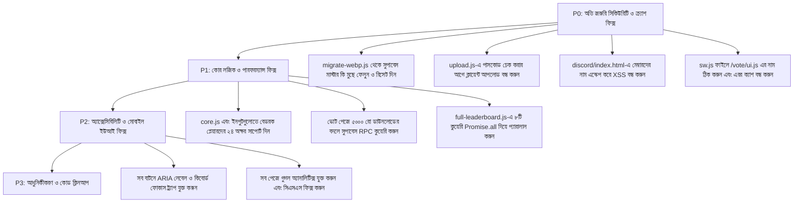

# 🛡️ হেভেনক্রাফট (HavenCraft) — পূর্ণাঙ্গ ওয়েবসাইট অডিট রিপোর্ট (সিকিউরিটি, পারফরম্যান্স ও কিউএ)

> **অডিটের তারিখ:** ১৪ সেপ্টেম্বর, ২০২৬  
> **অডিটকারী:** এলিট ফুল-স্ট্যাক ওয়েব ডেভেলপার, সিকিউরিটি এক্সপার্ট ও সিনিয়র কিউএ অডিটর  
> **টার্গেট প্রজেক্ট:** HavenCraft SMP Website (`HavenCraft-main`)  
> **টার্গেট কোয়ালিটি মানদণ্ড:** ৯৯.৯৯% নিখুঁত এবং প্রোডাকশন-গ্রেড স্ট্যাবিলিটি  

---

## 📑 সূচিপত্র (Table of Contents)
1. [সারসংক্ষেপ এবং প্রধান ঝুঁকির তালিকা (Executive Summary)](#সারসংক্ষেপ-এবং-প্রধান-ঝুঁকির-তালিকা)
2. [মডিউল ১: ব্যাকএন্ড এবং সার্ভারলেস এপিআই (Backend & Serverless APIs)](#মডিউল-১-ব্যাকএন্ড-এবং-সার্ভারলেস-এপিআই)
3. [মডিউল ২: ভোট সিস্টেম ও সুপাবেস ডাটাবেস (Voting System & Supabase)](#মডিউল-২-ভোট-সিস্টেম-ও-সুপাবেস-ডাটাবেস)
4. [মডিউল ৩: কোর স্ক্রিপ্ট, ইউটিলিটি ও সার্ভিস ওয়ার্কার (Core & Service Worker)](#মডিউল-৩-কোর-স্ক্রিপ্ট-ইউটিলিটি-ও-সার্ভিস-ওয়ার্কার)
5. [মডিউল ৪: ডায়নামিক ফিচারসমূহ (Profile, Leaderboard, Gallery, Store, Staff)](#মডিউল-৪-ডায়নামিক-ফিচারসমূহ)
6. [মডিউল ৫: এইচটিএমএল পেজ, এসইও ও অ্যাক্সেসিবিলিটি (HTML, SEO & a11y)](#মডিউল-৫-এইচটিএমএল-পেজ-এসইও-ও-অ্যাক্সেসিবিলিটি)
7. [মডিউল ৬: সিএসএস ও রেসপন্সিভ ডিজাইন (CSS & Mobile Layout)](#মডিউল-৬-সিএসএস-ও-রেসপন্সিভ-ডিজাইন)
8. [মডিউল ৭: বিল্ড স্ক্রিপ্ট ও অটোমেশন (Build.js & Tooling)](#মডিউল-৭-বিল্ড-স্ক্রিপ্ট-ও-অটোমেশন)
9. [ধাপে ধাপে সমাধান করার রোডম্যাপ (Priority Fix Matrix)](#ধাপে-ধাপে-সমাধান-করার-রোডম্যাপ)

---

## সারসংক্ষেপ এবং প্রধান ঝুঁকির তালিকা

HavenCraft-main ওয়েবসাইটে চমৎকার অ্যানিমেশন, আধুনিক ডিজাইন এবং দারুণ সব ফিচার রয়েছে। কিন্তু কোডের প্রতিটি লাইন গভীরভাবে পর্যবেক্ষণ করার পর বেশ কিছু **ভয়াবহ সিকিউরিটি ঝুঁকি (P0), ডাটাবেস মুছে যাওয়ার ঝুঁকি, ব্রাউজার ক্র্যাশ এবং বেডরক প্লেয়ারদের গেম ডাটা লোড না হওয়ার মতো বড় সমস্যা** পাওয়া গেছে:

| ক্যাটাগরি | গুরুত্ব (Severity) | সমস্যার সারসংক্ষেপ |
| :--- | :---: | :--- |
| **P0 সিকিউরিটি** | **চরম বিপজ্জনক (CRITICAL)** | `migrate-webp.js` ফাইলে সুপাবেসের মাস্টার সিক্রেট কি (`service_role`) সরাসরি লেখা রয়েছে, যা দিয়ে যে কেউ পুরো ডাটাবেস মুছে ফেলতে পারে। |
| **P0 সিকিউরিটি** | **চরম বিপজ্জনক (CRITICAL)** | `upload.js`-এ পাসকোড চেক করার আগেই ক্লায়েন্টের ব্রাউজার থেকে ছবি সরাসরি ক্লাউড স্টোরেজে আপলোড হয়ে যাচ্ছে। ফলে যে কেউ পাসকোড ছাড়াই স্টোরেজ ফুল করে দিতে পারবে। |
| **P0 সিকিউরিটি** | **উচ্চ (HIGH)** | ডিসকর্ড পেজে (`discord/index.html`) মেম্বারদের নাম ও স্ট্যাটাস সরাসরি `innerHTML`-এ দেওয়ায় XSS হ্যাকিংয়ের ঝুঁকি রয়েছে। |
| **P0 স্ট্যাবিলিটি** | **চরম বিপজ্জনক (CRITICAL)** | সার্ভিস ওয়ার্কার (`sw.js`) সার্ভারের সাময়িক 404 বা 500 এরর পেজকে চিরতরে ক্যাশ করে ফেলে, ফলে একবার এরর আসলে ইউজারের সাইট আজীবনের জন্য আটকে যায়। তাছাড়া লিনাক্স সার্ভারে বড় হাতের অক্ষরের কারণে `/vote/UI.js` 404 হবে। |
| **P1 লজিক বাগ** | **উচ্চ (HIGH)** | সব ইনপুট ফিল্ড ও লগইনে `maxlength="16"` দেওয়া। ফলে বেডরক প্লেয়াররা (যাদের নামের শুরুতে ডট `.` থাকে এবং নাম ২৪ অক্ষর পর্যন্ত হয়) লগইন বা ভোট স্ট্যাটাস চেক করতে পারছেন না। |
| **P1 পারফরম্যান্স** | **উচ্চ (HIGH)** | ব্রাউজারে ভোট সংখ্যা গুনতে গিয়ে ৫০০০টি ডাটাবেস রো একসাথে ডাউনলোড করা হচ্ছে। এতে মোবাইল ফোনে প্রচুর ইন্টারনেট নষ্ট হয় এবং ফোন ল্যাগ করে। |
| **P1 পারফরম্যান্স** | **উচ্চ (HIGH)** | লিডারবোর্ড ও প্রোফাইল পেজে একের পর এক সিরিয়ালে ৮টি কুয়েরি চালানো হচ্ছে (`for` লুপের ভেতর `await`), যার কারণে পেজ লোড হতে অনেক দেরি হয়। |
| **P2 আর্কিটেকচার** | **মাঝারি (MEDIUM)** | `build.js` দিয়ে যে বান্ডেল ফাইল বানানো হয়, তা কোনো এইচটিএমএল পেজেই ব্যবহার করা হচ্ছে না। |

---

## মডিউল ১: ব্যাকএন্ড এবং সার্ভারলেস এপিআই

---

### ১. `scripts/migrate-webp.js`

#### 🔴 Security & Critical Bugs:
- **মাস্টার সিক্রেট কি ফাঁস (Exposed Service Role Secret):** ২৩ নম্বর লাইনে সুপাবেসের `service_role` মাস্টার সিক্রেট টোকেন সরাসরি হার্ডকোড করা আছে (`eyJhbGciOiJIUzI1NiIsInR5cCI6IkpXVCJ9...`)। এই টোকেনটি দিয়ে সুপাবেসের সমস্ত Row Level Security (RLS) বাইপাস করা যায়। কোনো হ্যাকার বা বহিরাগত ব্যক্তি যদি গিটহাবে বা কোডে এই কি পেয়ে যায়, তবে সে এক সেকেন্ডেই আপনার সম্পূর্ণ ডাটাবেসের সমস্ত টেবিল ও ডাটা ডিলিট করে দিতে পারবে!
- **সার্ভার হ্যাং হওয়ার ঝুঁকি (DoS):** ৬৪ নম্বর লাইনে `fetch(record.image_url)` ব্যবহার করা হয়েছে, কিন্তু সেখানে কোনো টাইমআউট (`AbortController`) বা ফাইলের সাইজ লিমিট নেই। কোনো নষ্ট লিংকের কারণে স্ক্রিপ্ট চিরতরে আটকে থাকবে।

#### ⚠️ Performance & Speed Issues:
- **সিরিয়াল ইমেজ প্রসেসিং:** ইমেজগুলো একের পর এক সিরিয়ালে প্রসেস করা হচ্ছে। ১০০টি ছবি থাকলে রূপান্তর করতে অনেক মিনিট সময় লেগে যাবে। প্যারালাল প্রসেসিং (যেমন `p-limit`) ব্যবহার করলে ৪ গুণ দ্রুত কাজ হবে।
- **র‍্যামের ওপর চাপ:** পুরো ছবির ডাটা বাফারে (`Buffer.from`) লোড করার ফলে বড় ফাইলের ক্ষেত্রে মেমরি ক্র্যাশ (Heap out of memory) হতে পারে।

#### 🎨 UI/UX, SEO & Responsiveness:
- প্রযোজ্য নয় (এটি কমান্ড লাইন স্ক্রিপ্ট)।

#### 🟠 Logic Flaws & Improvements:
- **ফাইলের নামের সমস্যা:** ৮১ নম্বর লাইনে `split('/')` দিয়ে ফাইলের নাম নেওয়া হচ্ছে। ইউআরএল-এ যদি কুয়েরি প্যারামিটার (যেমন `?v=1`) থাকে, তাহলে ফাইলের নাম নষ্ট হয়ে যাবে। `new URL(record.image_url).pathname` ব্যবহার করা উচিত।

#### 🚀 Modernization & UX Suggestions:
- **অবিলম্বে অ্যাকশন নিন:** ফাইল থেকে হার্ডকোডেড কি মুছে ফেলুন এবং সুপাবেস ড্যাশবোর্ড থেকে এই `service_role` কি অবিলম্বে **Rotate/Reset** করুন। কি সবসময় `.env` ফাইল থেকে লোড করতে হবে।

---

### ২. `api/contact.js`

#### 🔴 Security & Critical Bugs:
- **সার্ভার ক্র্যাশ বাগ (Unhandled Destructuring):** ৭ নম্বর লাইনটি (`const { name, email, subject, message } = req.body;`) `try...catch`-এর **বাইরে** লেখা হয়েছে। যদি কোনো রিকোয়েস্টে বডি ফাঁকা থাকে বা ভুল ফরম্যাটের ডাটা আসে, তাহলে `req.body` হবে `undefined`। ফলে সার্ভার সাথে সাথে ক্র্যাশ করে ৫০০ ইন্টারনাল সার্ভার এরর দিবে।
- **স্প্যামিং ও কোটা শেষ হওয়ার ঝুঁকি (No Rate Limiting / Captcha):** এখানে কোনো রেট লিমিটিং বা ক্যাপচা নেই। যে কেউ স্ক্রিপ্ট চালিয়ে প্রতি সেকেন্ডে শত শত রিকোয়েস্ট পাঠাতে পারবে। এতে আপনার Web3Forms-এর ফ্রি কোটা শেষ হয়ে যাবে এবং মালিকের জিমেইলে হাজার হাজার স্প্যাম মেইল জমা হবে।
- **বড় সাইজের ডাটা আক্রমণ:** মেসেজের দৈর্ঘ্যের কোনো লিমিট নেই। হ্যাকার চাইলে একবারে ১০ মেগাবাইট টেক্সট পাঠিয়ে সার্ভারলেস ফাংশনের মেমরি জ্যাম করে দিতে পারে।

#### ⚠️ Performance & Speed Issues:
- ২১–৩১ নম্বর লাইনে `FormData` তৈরি করে Web3Forms-এ পাঠানো হচ্ছে। নোড জেএস ব্যাকএন্ডে সরাসরি JSON পাঠানো অনেক বেশি হালকা ও দ্রুত।

#### 🎨 UI/UX, SEO & Responsiveness:
- প্রযোজ্য নয় (ব্যাকএন্ড এপিআই)।

#### 🟠 Logic Flaws & Improvements:
- ইমেইলের ফরম্যাট সঠিক কিনা (যেমন `@` এবং ডোমেন আছে কিনা) তা ভ্যালিডেট করা হয়নি। ভুলভাল টেক্সট দিলেও সাবমিট হয়ে যাবে।

#### 🚀 Modernization & UX Suggestions:
- ডাটা নেওয়ার সময় সেফগার্ড যোগ করুন:
  ```javascript
  const body = req.body || {};
  const name = String(body.name || '').trim().slice(0, 100);
  const email = String(body.email || '').trim().slice(0, 120);
  const message = String(body.message || '').trim().slice(0, 3000);
  ```
- Cloudflare Turnstile অথবা Honeypot প্রোটেকশন যোগ করুন।

---

### ৩. `api/status.js`

#### 🔴 Security & Critical Bugs:
- **১০ সেকেন্ড টাইমআউট হয়ে সার্ভারলেস ফেইল হওয়া:** ১১–৩৮ নম্বর লাইনে ৪টি সার্ভার স্ট্যাটাস প্রোভাইডারের কাছে একের পর এক সিরিয়ালে ৩.৫ সেকেন্ড করে রিকোয়েস্ট পাঠানো হয়। যদি প্রথম দুটি প্রোভাইডার স্লো থাকে বা ডাউন থাকে, তাহলে $৩.৫ + ৩.৫ = ৭$ সেকেন্ড নষ্ট হবে। ভার্সেল ফ্রি টিয়ারে ১০ সেকেন্ড লিমিট থাকায় পুরো এপিআই টাইমআউট (504 Gateway Timeout) হয়ে যাবে!
- **MOTD ডাটা টাইপ ভেঙে যাওয়া:** ২৯ নম্বর লাইনে:
  `motd: data.motd?.clean || ...`
  `mcsrvstat.us` প্রোভাইডার `clean` ফিল্ডে একটি **Array (অ্যারে)** পাঠায় (যেমন `["HavenCraft", "Join Now"]`), কিন্তু `mcstatus.io` পাঠায় **String (স্ট্রিং)**। অ্যারে পাঠালে ফ্রন্টএন্ডে জাভাস্ক্রিপ্ট স্ট্রিং ফাংশনগুলো ক্র্যাশ করবে!

#### ⚠️ Performance & Speed Issues:
- সিরিয়ালি একটির পর একটি ট্রাই না করে `Promise.any()` দিয়ে সবগুলো প্রোভাইডারকে একসাথে কল করা উচিত, যেটি সবার আগে সঠিক রেসপন্স দেবে সেটিই ইউজারকে দেখানো উচিত।

#### 🎨 UI/UX, SEO & Responsiveness:
- প্রযোজ্য নয়।

#### 🟠 Logic Flaws & Improvements:
- হেভেনক্রাফট মূলত পেপার/পারপার ভিত্তিক জাভা সার্ভার এবং গিজার প্লাগইনের মাধ্যমে বেডরক কানেক্ট হয়। কিন্তু কোডে প্রথমে বেডরক পোর্ট কুয়েরি করা হচ্ছে। জাভা কুয়েরি আগে করলে প্লেয়ারদের সঠিক নাম ও নিখুঁত ভার্সন ইনফো পাওয়া যায়।

#### 🚀 Modernization & UX Suggestions:
- MOTD হ্যান্ডলিং ফিক্স করুন:
  ```javascript
  const cleanMotd = Array.isArray(data.motd?.clean)
      ? data.motd.clean.join(' ')
      : (typeof data.motd?.clean === 'string' ? data.motd.clean : '');
  ```

---

### ৪. `api/submit-gallery.js`

#### 🔴 Security & Critical Bugs:
- **স্টাফ পাসকোড ব্রুট-ফোর্স ঝুঁকি (Brute-Force Attack):** ১৬–২৩ নম্বর লাইনে স্টাফ পাসকোড চেক করা হয়, কিন্তু ভুল পাসকোড দিলে কোনো ডிலே বা রেট লিমিট নেই। একজন হ্যাকার অনায়াসেই স্ক্রিপ্ট চালিয়ে সেকেন্ডে ৫০ বার ট্রাই করে সঠিক পাসকোড বের করে ফেলতে পারবে।
- **ক্ষতিকর ইমেজ ইউআরএল বা XSS ইনজেকশন:** ক্লায়েন্ট থেকে আসা `imageUrl` সরাসরি ডাটাবেসে সেভ করা হয় (লাইন ৪৩–৪৭)। ছবিটি আসলেও আপনার সুপাবেস স্টোরেজের কিনা তা চেক করা হয় না। হ্যাকার চাইলে `javascript:...` অথবা ফিশিং লিংক সেভ করে দিতে পারে, যা গ্যালারি পেজে সব ইউজারের সামনে লোড হবে।
- বডি পার্সিং ক্র্যাশ: ৭ নম্বর লাইনটি `try...catch`-এর বাইরে থাকায় ইনপুট না থাকলে সার্ভার ৫০০ এরর দিয়ে ক্র্যাশ করবে।

#### ⚠️ Performance & Speed Issues:
- প্রতিবার রিকোয়েস্ট আসার পর ১৭ নম্বর লাইনে `JSON.parse` দিয়ে পরিবেশ ভেরিয়েবল পার্স করা হচ্ছে। এটি ফাংশন হ্যান্ডলারের বাইরে একবার পার্স করে রাখলে সার্ভারের পারফরম্যান্স ভালো থাকবে।

#### 🎨 UI/UX, SEO & Responsiveness:
- প্রযোজ্য নয়।

#### 🟠 Logic Flaws & Improvements:
- ছবির ক্যাপশনের কোনো ম্যাক্সিমাম সাইজ লিমিট নেই। কেউ চাইলে ৫০,০০০ অক্ষরের টেক্সট পাঠিয়ে ডাটাবেস ভারী করে দিতে পারে।

#### 🚀 Modernization & UX Suggestions:
- ইমেজ ইউআরএলটি অবশ্যই আপনার সুপাবেস স্টোরেজ ডোমেনের কিনা তা নিশ্চিত করুন:
  ```javascript
  const ALLOWED_URL = 'https://rbrrkphtobxcmnzshnqj.supabase.co/storage/v1/object/public/gallery/';
  if (!imageUrl.startsWith(ALLOWED_URL)) {
      return res.status(400).json({ error: 'ভুল ইমেজ সোর্স!' });
  }
  ```

---

### ৫. `vercel.json`

#### 🔴 Security & Critical Bugs:
- **HSTS হেডার অনুপস্থিত:** `Strict-Transport-Security` হেডার না থাকায় ব্যবহারকারীর কানেকশনকে হ্যাকাররা ডাউনগ্রেড করে অনিরাপদ HTTP-তে নিয়ে যেতে পারে।
- **সিএসপি (CSP) পলিসিতে ফলব্যাক এপিআই ব্লক:** ৭২ নম্বর লাইনে `connect-src`-এ `https://api.mcsrvstat.us` অনুমতি দেওয়া আছে, কিন্তু **`https://api.mcstatus.io` বাদ পড়েছে**! ফলে সার্ভার স্ট্যাটাস দেখার সময় মেইন এপিআই ফেইল করলে ব্রাউজার যখন `mcstatus.io`-তে রিকোয়েস্ট পাঠাতে যায়, তখন ব্রাউজারের সিকিউরিটি পলিসি নিজেই সেই রিকোয়েস্ট ব্লক করে দেয়!

#### ⚠️ Performance & Speed Issues:
- মূল এইচটিএমএল ফাইলগুলোতে কোনো `Cache-Control` ডিফাইন করা নেই। ফলে ওয়েবসাইট আপডেট করলে কোনো কোনো ইউজারের কাছে পুরনো পেজ ক্যাশ থেকে লোড হতে পারে।

#### 🎨 UI/UX, SEO & Responsiveness:
- `"cleanUrls": true` দেওয়া আছে, কিন্তু `sitemap.xml`-এ লিংকগুলোতে শেষে স্ল্যাশ (`/vote/`) দেওয়া। এটি রিডাইরেক্ট বাড়িয়ে পেজ লোড সামান্য ধীর করে।

#### 🟠 Logic Flaws & Improvements:
- `/api/:path*` ফেইল করলে `/404.html` রিটার্ন করা হয়। এপিআই রিকোয়েস্টে এইচটিএমএল পেজ রিটার্ন করলে ফ্রন্টএন্ড জাভাস্ক্রিপ্ট JSON পার্স করতে গিয়ে `SyntaxError: Unexpected token < in JSON` এরর দেয়। এপিআই-এর জন্য JSON এরর দেওয়া উচিত।

#### 🚀 Modernization & UX Suggestions:
- `vercel.json`-এ সিকিউরিটি হেডার যুক্ত করুন:
  ```json
  {
    "key": "Strict-Transport-Security",
    "value": "max-age=31536000; includeSubDomains; preload"
  }
  ```
- CSP `connect-src`-এ `https://api.mcstatus.io` যোগ করুন।

---

## মডিউল ২: ভোট সিস্টেম ও সুপাবেস ডাটাবেস

---

### ১. `vote/config.js`

#### 🔴 Security & Critical Bugs:
- **কোড ডুপ্লিকেশন ও অমিল:** এখানে `VOTE_SITES` কনফিগারেশন আছে, আবার `assets/js/core.js` ফাইলেও (লাইন ১২০–১২৯) একই তালিকা কপি-পেস্ট করা আছে। ভবিষ্যতে নতুন কোনো সাইট যোগ করলে বা কুলডাউন পরিবর্তন করলে এক জায়গায় আপডেট হবে কিন্তু অন্য পেজে পুরনো কুলডাউন থেকে যাবে।

#### ⚠️ Performance & Speed Issues:
- কোডটি গ্লোবাল `window.VOTE_SITES`-এ সরাসরি ভেরিয়েবল রাখছে, যা বড় অ্যাপ্লিকেশনে নেমস্পেস কলিশন তৈরি করতে পারে।

#### 🎨 UI/UX, SEO & Responsiveness:
- সাইটগুলোর কুলডাউন ফিক্সড ৬ বা ২৪ ঘণ্টা। কিন্তু কিছু সাইটের নিজস্ব টাইমিং ভিন্ন থাকে।

#### 🟠 Logic Flaws & Improvements:
- ইউজারনেম অটো-ফিল করার জন্য কোনো ডাইনামিক টেমপ্লেট স্ট্রিং (যেমন `{username}`) নেই।

#### 🚀 Modernization & UX Suggestions:
- `core.js` থেকে ডুপ্লিকেট তালিকাটি মুছে দিয়ে শুধুমাত্র `vote/config.js` কেই একমাত্র তথ্যসূত্র (Single Source of Truth) হিসেবে রাখুন।

---

### ২. `vote/validation.js`

#### 🔴 Security & Critical Bugs:
- **ইউজারনেম ফিল্টারিংয়ে অতিরিক্ত ছাড়:** ২ নম্বর লাইনে `^[a-zA-Z0-9_. *+-]{3,24}$` দেওয়া হয়েছে। ফলে কেউ যদি `+++` বা `***` লেখে তাও ভ্যালিড দেখাবে। বেডরক প্লেয়ারদের জন্য স্পেস এবং Floodgate-এর ডট `.` দরকার হলেও অপ্রয়োজনীয় চিহ্ন বাদ দেওয়া উচিত।

#### ⚠️ Performance & Speed Issues:
- কোনো সমস্যা নেই, রেজেক্স খুব দ্রুত কাজ করে।

#### 🎨 UI/UX, SEO & Responsiveness:
- প্রযোজ্য নয়।

#### 🟠 Logic Flaws & Improvements:
- **একই ফাংশন তিন ফাইলে তিনবার লেখা:** `validation.js`-এ আছে `sanitizeText`, আবার `utils.js`-এ আছে `escapeHtml`, এবং `navbar.js`-এ আছে আরেকটা `escapeHtml`। একাধিক স্ক্রিপ্টে আলাদা আলাদা ফাংশন থাকায় বিভ্রান্তি তৈরি হয়।

#### 🚀 Modernization & UX Suggestions:
- সেন্ট্রাল ফাংশন হিসেবে `HavenCraftCore.escapeHtml()` তৈরি করুন।

---

### ৩. `vote/cooldown.js`

#### 🔴 Security & Critical Bugs:
- **ব্যবহারকারীর পিসির ঘড়ি অনুযায়ী কুলডাউন ভুল হওয়া (Client Clock Tampering):** ৪৭ নম্বর লাইনে `const now = Date.now();` লেখা হয়েছে। অর্থাৎ ইউজারের কম্পিউটারের বর্তমান ঘড়ি অনুযায়ী হিসাব হচ্ছে।
  - যদি কোনো প্লেয়ারের পিসির ঘড়ি ১০ মিনিট স্লো থাকে, তাহলে কুলডাউন ২৪ ঘণ্টার জায়গায় দেখাবে ২৪ ঘণ্টা ১০ মিনিট!
  - আবার কোনো প্লেয়ার তার পিসির ঘড়ি ১ দিন বাড়িয়ে দিলে সাথে সাথে সব বাটন "Ready to vote" হয়ে যাবে (যদিও সে ভোট সাইটে গেলে ভোট দিতে পারবে না)।
  - **সমাধান:** সার্ভারের বর্তমান সময়ের সাথে ইউজারের পিসির সময়ের পার্থক্য বের করে কুলডাউন হিসাব করা দরকার।

#### ⚠️ Performance & Speed Issues:
- ৭২–৮৮ নম্বর লাইনে প্রতিটি ডাটাবেস ভোটের জন্য একাধিকবার রেগুলার এক্সপ্রেশন (`.replace(/[^a-z0-9]/g, '')`) ও স্ট্রিং যোগ করা হচ্ছে। ইউজারের অনেক ভোট থাকলে মোবাইল ব্রাউজারে ল্যাগ হতে পারে।

#### 🎨 UI/UX, SEO & Responsiveness:
- টাইমার শেষ হয়ে `00:00:00` হলে ইউজার কনফিউজড হতে পারে যদি সাথে সাথে বাটনটি সবুজ হয়ে "ভোট দিন" না হয়।

#### 🟠 Logic Flaws & Improvements:
- ডাটাবেস সাইট নেইম ও এলিয়াস ম্যাচিংয়ের লজিকে জটিলতা রয়েছে। কিছু সাইটের ডোমেইন এক্সটেনশন (`.nl`, `.io`) ম্যাচ করতে গিয়ে মিসম্যাচ হতে পারে।

#### 🚀 Modernization & UX Suggestions:
- এলিয়াস তালিকাটি আগে থেকেই একবার ক্লিন করে মেমরিতে রেখে দিন, প্রতি সেকেন্ডে লুপের মধ্যে রেজেক্স না চালিয়ে।

---

### ৪. `vote/supabase.js`

#### 🔴 Security & Critical Bugs:
- **SQL ওয়াইল্ডকার্ড ইনজেকশন:** ৩৫ নম্বর লাইনে `.ilike('username', cleanUsername)` ব্যবহার করা হয়েছে। যদি কোনো ইউজার ইনপুটে `%` বা `_` চিহ্ন দেয়, তবে পোস্টগ্রেস এসকিউএল এটিকে প্যাটার্ন ধরে নেয়। `%` দিলে সবার ভোট কুয়েরি হয়ে যাবে!
  - **ফিক্স:** `cleanUsername.replace(/[%_]/g, '\\$&')` দিয়ে চিহ্নগুলো এস্কেপ করুন।

#### ⚠️ Performance & Speed Issues:
- **৫,০০০ রো ক্লায়েন্টে ডাউনলোড করার মারাত্মক অপচয়:** ৮১–৮৬ এবং ১৩৫–১৪১ নম্বর লাইনে ভোট সংখ্যা গুনার জন্য ব্রাউজারে ৫,০০০টি ডাটাবেস রো নামিয়ে আনা হচ্ছে!
  ```javascript
  const { data: rows } = await window.supabaseVote
      .from('votes')
      .select('username')
      .gte('created_at', startDate)
      .limit(5000);
  ```
  সাধারণ একটি সংখ্যা বের করার জন্য মোবাইল ফোনের ডাটা দিয়ে এত বড় ফাইল ডাউনলোড করানো খুবই অপেশাদার এবং ধীরগতির।
- **ডাটার ভুল পরিসংখ্যান (৫,০০০ লিমিট সমস্যা):** সার্ভারে যদি মাসে ৫,০০০ এর বেশি ভোট পড়ে, তবে ৫,০০১তম ভোটটি আর হিসাবে আসবে না। ফলে লিডারবোর্ড পুরোপুরি ভুল রেজাল্ট দেখাবে!
- **অল-টাইম লিডারবোর্ডের ভুল:** `fetchWallOfFame('alltime')`-এও ৫,০০০ লিমিট দেওয়া। অর্থাৎ যারা সার্ভারের শুরুর দিকে ভোট দিয়েছিল তাদের নাম কখনোই অল-টাইম তালিকায় আসবে না!

#### 🎨 UI/UX, SEO & Responsiveness:
- প্রযোজ্য নয়।

#### 🟠 Logic Flaws & Improvements:
- `fetchLeaderboard` এবং `fetchWallOfFame` ফাংশনে `initSupabase()` কল করা হয়নি। সুপাবেস রেডি হওয়ার আগে এগুলো কল হলে ফাঁকা অ্যারে রিটার্ন করে বসে থাকে।

#### 🚀 Modernization & UX Suggestions:
- সুপাবেস ডাটাবেসে একটি সার্ভার-সাইড ফাংশন (RPC) অথবা ভিউ (View) তৈরি করুন:
  ```sql
  CREATE OR REPLACE FUNCTION get_vote_leaderboard(period_start timestamptz, limit_count int)
  RETURNS TABLE (username text, vote_count bigint) AS $$
    SELECT username, COUNT(*) as vote_count
    FROM votes
    WHERE created_at >= period_start
    GROUP BY username
    ORDER BY vote_count DESC
    LIMIT limit_count;
  $$ LANGUAGE sql STABLE;
  ```
  এতে ৫,০০০ রো ডাউনলোড করার বদলে ব্রাউজারে মাত্র ১০টি রো আসবে, সাইট সাথে সাথে ২৫ গুণ দ্রুত হয়ে যাবে!

---

### ৫. `vote/ui.js` & `vote/vote.js`

#### 🔴 Security & Critical Bugs:
- **ইনলাইন জাভাস্ক্রিপ্টে ভাঙা এস্কেপিং:** `vote/ui.js`-এর ৩৯–৪০ নম্বর লাইনে:
  ```javascript
  const safeSiteName = sanitizeText(site.name).replace(/'/g, "\\'");
  let btnHTML = `<a ... onclick="if(window.handleVoteClick) window.handleVoteClick('${site.id}', '${safeSiteName}', ...)">`;
  ```
  `sanitizeText` আগেই সিঙ্গল কোটকে `&#039;`-এ রূপান্তর করে ফেলে, ফলে পরের রিপ্লেস কাজ করে না। তাছাড়া `site.id` এস্কেপ করা হয়নি। এটি ইনলাইন এইচটিএমএল-এ কোড ব্রেক করতে পারে।
- **হ্যাশ লিংকে প্যারামিটার যুক্ত হওয়া:** ৩২–৩৬ নম্বর লাইনে যদি সাইটের লিঙ্ক `#` হয়, কোডটি সেটিকে বানায় `#?username=...` যা ব্রাউজারে কোনো লিঙ্কে না গিয়ে পেজ জাম্প করায়।

#### ⚠️ Performance & Speed Issues:
- **২৪ ঘণ্টার `setTimeout` কাজ না করা:** `vote.js`-এর ৩৩৩ নম্বর লাইনে ২৪ ঘণ্টার (৮৬,৪০০,০০০ মিলি সেকেন্ড) টাইমার সেট করা হয়েছে:
  `voteReminderTimer = setTimeout(..., cooldownMs);`
  কোনো ব্রাউজারই ব্যাকগ্রাউন্ড ট্যাবে বা ল্যাপটপ স্লিপে গেলে এত বড় টাইমার চালু রাখতে পারে না। ইউজার ট্যাব বন্ধ করলে এই নোটিফিকেশন আর কখনোই আসবে না!

#### 🎨 UI/UX, SEO & Responsiveness:
- **বেডরক প্লেয়ারদের নাম আটকে যাওয়া (`maxlength="16"`):** `vote/index.html`-এর ৬২ নম্বর লাইনে ইনপুট বক্সে `maxlength="16"` দেওয়া। বেডরক প্লেয়ারদের নামের শুরুতে ডট (`.`) সহ ১৭–২৪ অক্ষর হতে পারে, ফলে তারা পুরো নাম টাইপই করতে পারেন না!
- ছোট মোবাইল স্ক্রিনে (৩৬০ পিক্সেলের নিচে) কাউন্টডাউন টাইমার বক্স ভেঙে নিচে নেমে যায়।

#### 🟠 Logic Flaws & Improvements:
- `clearCountdown()` ঠিকমতো ক্লিয়ার হলেও ইউজার বারবার "Check Status" চাপলে অপ্রয়োজনীয় রি-রেন্ডার হয়।

#### 🚀 Modernization & UX Suggestions:
- ইনলাইন `onclick="..."` স্ট্রিং বাদ দিয়ে ইভেন্ট লিসেনার (`addEventListener`) ব্যবহার করুন।
- ইনপুট ফিল্ডের `maxlength="16"` পরিবর্তন করে `maxlength="24"` করুন।
- ২৪ ঘণ্টার নোটিফিকেশনের জন্য ব্রাউজার সার্ভিস ওয়ার্কার পুশ নোটিফিকেশন বা ব্যাকগ্রাউন্ড সিঙ্ক ব্যবহার করুন।

---

## মডিউল ৩: কোর স্ক্রিপ্ট, ইউটিলিটি ও সার্ভিস ওয়ার্কার

---

### ১. `assets/js/core.js`

#### 🔴 Security & Critical Bugs:
- **সুপাবেস পাবলিক কি ও RLS পলিসির ওপর ঝুঁকি:** এখানে সুপাবেসের পাবলিক এনন কি রয়েছে। এটি স্বাভাবিক হলেও, সুপাবেস ডাটাবেসে যদি **Row Level Security (RLS)** ঠিকমতো অন না থাকে, তবে যে কেউ ব্রাউজার কনসোল থেকে `supabase.from('votes').delete()` চালিয়ে সমস্ত ভোট রেকর্ড ডিলিট করে দিতে পারবে!
- **বেডরক প্লেয়ারদের লগইন ব্লক:** ৮৬ নম্বর লাইনে:
  ```javascript
  if (!gametag || gametag.length < 3 || gametag.length > 16) {
      return { success: false, error: 'Invalid username' };
  }
  ```
  ১৬ অক্ষরের বেশি নাম হলে কোড এরর দিচ্ছে! এর ফলে সার্ভারের সকল বেডরক প্লেয়ার সাইটে লগইন করতে পারছেন না।

#### ⚠️ Performance & Speed Issues:
- কোনো বড় সমস্যা নেই।

#### 🎨 UI/UX, SEO & Responsiveness:
- প্রযোজ্য নয়।

#### 🟠 Logic Flaws & Improvements:
- `login()` ফাংশনে ইউজারের নামের ভেতর কোনো ক্ষতিকর স্ক্রিপ্ট বা ট্যাগ আছে কিনা চেক না করেই তা লোকাল স্টোরেজে রাখা হচ্ছে।

#### 🚀 Modernization & UX Suggestions:
- ইউজারনেম ভ্যালিডেশন ২৪ অক্ষর পর্যন্ত অনুমোদন করুন এবং Floodgate প্লেয়ারদের সাপোর্ট দিন:
  ```javascript
  if (!gametag || gametag.length < 3 || gametag.length > 24) { ... }
  ```

---

### ২. `assets/js/utils.js`

#### 🔴 Security & Critical Bugs:
- **আপেক্ষিক পাথ ভাঙা (`../api/status`):** ৬ নম্বর লাইনে `API_URL = '../api/status'` দেওয়া। হোমপেজে (`/index.html`) এটি ঠিক থাকলেও কোনো গভীর ফোল্ডারে (যেমন `/gallery/upload.html`) গেলে এটি ভুল ইউআরএল-এ রিকোয়েস্ট পাঠাবে। এটি সবসময় `'/api/status'` হওয়া উচিত।
- **কনসোল এরর ঢেকে ফেলা (Error Swallowing):** ৫৩–৬০ নম্বর লাইনে `unhandledrejection` ইভেন্টে `event.preventDefault()` ব্যবহার করা হয়েছে। এতে করে আসল এরর কোন ফাইলে এবং কোন লাইনে হয়েছে তা ব্রাউজার কনসোলে আর দেখা যায় না, ফলে বাগ ফিক্স করা কঠিন হয়ে পড়ে।

#### ⚠️ Performance & Speed Issues:
- **ট্যাব মিনিমাইজ থাকলেও অনন্তকাল ধরে ডাটা টানা:** ২৮৫ নম্বর লাইনে `setInterval(fetchServerStatus, 30000)` রয়েছে। ইউজার যদি অন্য ট্যাবে কাজ করে বা ব্রাউজার মিনিমাইজ করে ঘুমিয়েও পড়ে, সাইট প্রতি ৩০ সেকেন্ড পর পর সার্ভারে রিকোয়েস্ট পাঠাতেই থাকে। এতে ইউজারের মোবাইল ডাটা এবং আপনার সার্ভারের প্রসেসর খরচ হয়।

#### 🎨 UI/UX, SEO & Responsiveness:
- সার্ভার অফলাইন থাকলে বড় সংখ্যাটি শুধুমাত্র `—` দেখায়। সার্ভার রক্ষণাবেক্ষণে আছে নাকি বন্ধ, তা বুঝা যায় না।

#### 🟠 Logic Flaws & Improvements:
- `getRootPath()` ফাংশনটি স্ক্রিপ্টের নাম খুঁজে পাথ বের করে। কিন্তু `build.js` দিয়ে সব স্ক্রিপ্ট এক ফাইলে বান্ডেল করলে এই ফাংশনটি ফেইল করবে।

#### 🚀 Modernization & UX Suggestions:
- Page Visibility API ব্যবহার করে ব্যাকগ্রাউন্ডে থাকলে পোলিং বন্ধ রাখুন:
  ```javascript
  document.addEventListener('visibilitychange', () => {
      if (document.hidden) clearInterval(statusTimer);
      else startStatusPolling();
  });
  ```

---

### ৩. `assets/js/navbar.js`

#### 🔴 Security & Critical Bugs:
- **এসকিউএল ওয়াইল্ডকার্ড ইনজেকশন:** ৪৫০ নম্বর লাইনে `.ilike('username', `%${query}%`)` ব্যবহার করা হয়েছে। সার্চ বক্সে `%` লিখলে ডাটাবেসের প্রথম ১০ জন প্লেয়ারকে র‍্যান্ডমলি এনে দেখাবে।

#### ⚠️ Performance & Speed Issues:
- ৪১২–৪৩২ নম্বর লাইনে প্রয়োজন হলে ডায়নামিকভাবে সুপাবেস স্ক্রিপ্ট ডমে ইনজেক্ট করা হয়। এতে স্ক্রিপ্ট লোডিংয়ের সময় রেস কন্ডিশন তৈরি হতে পারে।

#### 🎨 UI/UX, SEO & Responsiveness:
- **অ্যাক্সেসিবিলিটি (a11y) এর অভাব:** সার্চ বাটন, গেমট্যাগ বাটন এবং মোবাইল মেনু বাটনে কোনো `aria-expanded` বা `aria-haspopup` নেই। দৃষ্টিপ্রতিবন্ধী ব্যক্তিরা যারা স্ক্রিন রিডার ব্যবহার করেন, তারা বুঝতে পারবেন না মেনু খোলা নাকি বন্ধ।
- **সার্চ মডালে ফোকাস ট্র্যাপ নেই:** সার্চ মডাল খুললে কিবোর্ডের `Tab` বাটন চাপলে ফোকাস মডালের বাইরে পেজের নিচের এলিমেন্টগুলোতে চলে যায়।
- **মোবাইলে স্ক্রল লক হয়ে যাওয়া:** মেনু বা সার্চ বন্ধ করার কোনো ইভেন্ট মিস হলে পেজের বডিতে `overflow: hidden` থেকে যায়, ফলে ইউজার আর নিচে স্ক্রল করতে পারেন না।

#### 🟠 Logic Flaws & Improvements:
- গেমট্যাগ ইনপুটে `maxlength="16"` থাকায় বেডরক প্লেয়াররা নাম লিখতে পারেন না।

#### 🚀 Modernization & UX Suggestions:
- সার্চ কোয়েরি স্যানিটাইজ করুন এবং কিবোর্ড অ্যাক্সেসিবিলিটি (Focus Trapping) যুক্ত করুন।

---

### ৪. `assets/js/components.js`

#### 🔴 Security & Critical Bugs:
- **পেজ কেঁপে ওঠা ও ডিজাইন ভাঙা (FOUC & Layout Shift):** ১২–২৫ নম্বর লাইনে জাভাস্ক্রিপ্ট দিয়ে `pages.css` এবং `animations.css` ইনজেক্ট করা হচ্ছে!
  যেহেতু জাভাস্ক্রিপ্ট লোড হতে ২০০–৩০০ মিলি সেকেন্ড সময় নেয়, ততক্ষণে ব্রাউজার পেজটি সিএসএস ছাড়াই রেন্ডার করে ফেলে। এরপর হঠাৎ সিএসএস লোড হলে সব লেখা ও বাটন লাফ দিয়ে নিচে নেমে যায়। এতে গুগলের কোর ওয়েব ভাইটালস (Core Web Vitals - CLS) স্কোর মারাত্মকভাবে ক্ষতিগ্রস্ত হয়!
  - **সমাধান:** সিএসএস কখনোই জাভাস্ক্রিপ্ট দিয়ে ইনজেক্ট করবেন না। প্রতিটি এইচটিএমএল ফাইলের `<head>`-এ সরাসরি `<link rel="stylesheet">` দিয়ে রাখুন।

#### ⚠️ Performance & Speed Issues:
- জাভাস্ক্রিপ্ট দিয়ে আবার `animations.js` ইনজেক্ট করায় স্ক্রিপ্ট চলার সঠিক ধারাবাহিকতা নষ্ট হয়।

#### 🎨 UI/UX, SEO & Responsiveness:
- ফুটারের কপিরাইট সাল হার্ডকোড করে `2026` লেখা। ২০২৭ সালে এটি পুরনো দেখাবে যদি ডাইনামিক `new Date().getFullYear()` না করা হয়।

#### 🟠 Logic Flaws & Improvements:
- ফোটারে ইনলাইন `onclick="copyIP(this)"` রয়েছে।

#### 🚀 Modernization & UX Suggestions:
- ডাইনামিক সিএসএস ইনজেকশন পুরোপুরি বন্ধ করে এইচটিএমএল-এ লিঙ্ক করুন।

---

### ৫. `assets/js/animations.js`

#### 🔴 Security & Critical Bugs:
- **মেমরি লিক (Memory Leak Bug):** ২৫ নম্বর লাইনে:
  `circle.addEventListener('animationend', () => circle.remove());`
  যদি কোনো ইউজারের ডিভাইসে "Reduce Motion" অন থাকে, তবে ব্রাউজার সিএসএস অ্যানিমেশন বন্ধ করে দেয়। ফলে `animationend` ইভেন্ট **কখনোই ফায়ার হয় না**! এতে যতবার বাটনে ক্লিক করা হবে, শত শত অদৃশ্য `<span>` এলিমেন্ট ব্রাউজারের মেমরিতে জমা হতে থাকবে।

#### ⚠️ Performance & Speed Issues:
- **১০০,০০০ এর বেশি সংখ্যা হলে অ্যানিমেশন বন্ধ:** ৬৮ নম্বর লাইনে সংখ্যা যদি ১০০,০০০ এর বেশি হয় তবে অ্যানিমেশন অফ করে দেওয়া হয়েছে। সার্ভারের ইকোনমি বা মোট ভোট ১ লাখের বেশি হলে আর অ্যানিমেশন হবে না।

#### 🎨 UI/UX, SEO & Responsiveness:
- প্রথম ভিজিটে ১.৪ সেকেন্ডের জন্য পুরো স্ক্রিন কালো করে লোগো দেখানো হয়। স্লো নেটে এটি বিরক্তি তৈরি করে।

#### 🟠 Logic Flaws & Improvements:
- মোবাইলে স্ক্রল রিভিলের মার্জিন বেশি থাকায় কার্ডগুলো স্ক্রিনে ওঠার অনেক দেরিতে দৃশ্যমান হয়।

#### 🚀 Modernization & UX Suggestions:
- অ্যানিমেশন শেষ না হলেও যেন ০.৬ সেকেন্ড পর স্বয়ংক্রিয়ভাবে মেমরি থেকে স্প্যান মুছে যায় সেই ব্যাকআপ টাইমআউট দিন।

---

### ৬. `sw.js` (সার্ভিস ওয়ার্কার)

#### 🔴 Security & Critical Bugs:
- **P0 বড় হাতের অক্ষরের কারণে 404 ফাইল এরর:** ২৩ নম্বর লাইনে লেখা রয়েছে:
  `'/vote/UI.js'` (বড় হাতের UI!)
  উইন্ডোজে এটি কাজ করলেও লিনাক্স সার্ভার (Vercel, GitHub, Cloudflare)-এ ফাইল নাম কেস-সেনসিটিভ। সেখানে ফাইলটির নাম `vote/ui.js` (ছোট হাতের)। ফলে সার্ভার এটি খুঁজে না পেয়ে ৪MD Not Found এরর দিবে এবং সার্ভিস ওয়ার্কার ইন্সটল ফেইল করবে!
- **P0 মারাত্মক এরর পেজ ক্যাশ হয়ে যাওয়া:** ৬৯–৭২ নম্বর লাইনে:
  `fetch(event.request).then(response => { caches.put(event.request, response.clone()) })`
  সার্ভার যদি কোনো কারণে সাময়িক ৫০০ বা ৪০৪ এরর দেয়, তবে ব্রাউজার সেই এরর পেজটিকেই ক্যাশে পার্মানেন্ট সেভ করে ফেলে! পরবর্তীতে সার্ভার ঠিক হলেও ইউজার বারবার সেই এরর পেজটিই দেখতে পাবেন!
  - **ফিক্স:** শুধুমাত্র `response.status === 200` হলেই ক্যাশ করতে হবে।
- **ফলব্যাক লজিকের ভুল:** ৭৭ নম্বর লাইনে `caches.match('/') || caches.match('/index.html')` লেখা। জাভাস্ক্রিপ্টে `Promise` সবসময় সত্য (truthy)। ফলে পেছনের কোডটি কখনোই রান করে না।

#### ⚠️ Performance & Speed Issues:
- ইন্সটলের সময় একসাথে ৩০টি বড় ফাইল নেটওয়ার্ক জ্যাম করে রিলোড করে।

#### 🎨 UI/UX, SEO & Responsiveness:
- প্রযোজ্য নয়।

#### 🟠 Logic Flaws & Improvements:
- ভার্সন নেম `v63` হার্ডকোডেড। কোড পরিবর্তন করলে নিজে মনে করে ভার্সন না বাড়ালে ইউজাররা পুরনো কোডই পেতে থাকবে।

#### 🚀 Modernization & UX Suggestions:
- ২৩ নম্বর লাইনে `/vote/ui.js` ঠিক করুন এবং এরর কোড যেন কখনোই ক্যাশে সেভ না হয় সেই গার্ড দিন:
  ```javascript
  if (response.ok && response.status === 200) {
      const resClone = response.clone();
      caches.open(CACHE_NAME).then(cache => cache.put(event.request, resClone));
  }
  ```

---

## মডিউল ৪: ডায়নামিক ফিচারসমূহ

---

### ১. `profile/ranks.js` ও `assets/js/profile.js`

#### 🔴 Security & Critical Bugs:
- **স্টাফ র‍্যাঙ্ক নকল করার সুযোগ (Client-Side Rank Spoofing):** `ranks.js`-এ স্টাফদের নাম ওপেন জাভাস্ক্রিপ্টে লেখা। যে কেউ ব্রাউজার কনসোলে `window.STAFF_RANKS['নিজের_নাম'] = 'Owner'` লিখে দিয়ে "Save as Image" বাটন চাপলে তার নামের পাশে অফিশিয়াল "Owner" ব্যাজ সহ প্রোফাইল কার্ড ডাউনলোড হয়ে যাবে। এটি দিয়ে ফেসবুক বা ডিসকর্ডে সাধারণ প্লেয়ারদের সাথে প্রতারণা করা সম্ভব।
- **html2canvas ক্র্যাশ (Canvas Taint Bug):** ২১০ নম্বর লাইনে `mc-heads.net` থেকে বডি ইমেজ লোড হয়। কোনো কারণে ইমেজ সার্ভারের CORS রেসপন্স ফেইল করলে পুরো ইমেজ জেনারেশন ক্র্যাশ করে।

#### ⚠️ Performance & Speed Issues:
- **৭টি কুয়েরির N+1 সাইকেল:** ৩৯১–৪২১ নম্বর লাইনে প্রতিটি প্রোফাইল লোড হওয়ার সময় ৭টি আলাদা আলাদা কুয়েরি চালিয়ে ডাটাবেসে প্লেয়ারের র‍্যাঙ্ক চেক করা হয়। এতে ডাটাবেসের ওপর প্রচুর চাপ পড়ে এবং পেজ লোড হতে অনেক দেরি হয়।
- **ভোটের ডাটা আনলিমিটেড ডাউনলোড:** ৪৪৪–৪৪৯ নম্বর লাইনে কোনো `.limit()` নেই। কোনো প্লেয়ারের ৫,০০০ ভোট থাকলে সব রো ব্রাউজারে চলে আসে কেবল মোট সংখ্যা দেখার জন্য!

#### 🎨 UI/UX, SEO & Responsiveness:
- **হারিয়ে যাওয়া ফিচার:** ৪৫০ লাইনের পর `votesBySite` হিসাব করা হচ্ছে, কিন্তু প্রোফাইল পেজে ভোট কুলডাউন দেখানোর কোনো এইচটিএমএল বক্সই নেই! কোড রান হচ্ছে কিন্তু স্ক্রিনে কিছুই দেখাচ্ছে না।
- ৩২০–৩৭৫ পিক্সেলের ছোট মোবাইলে র‍্যাঙ্ক ব্যাজ লেখার ওপরে উঠে যায়।

#### 🟠 Logic Flaws & Improvements:
- প্লেয়ারের কিল ০ এবং ডেথ ০ হলে K/D রেশিও ০.০০ দেখায়, কিন্তু কিল ৫ এবং ডেথ ০ হলে ৫.০০ দেখায়। এটি স্ট্যান্ডার্ড মাইনক্রাফট ফরম্যাটে হ্যান্ডেল করা উচিত।

#### 🚀 Modernization & UX Suggestions:
- সব ভোট রো ডাউনলোড না করে শুধুমাত্র কাউন্ট কুয়েরি করুন:
  ```javascript
  const { count } = await window.supabaseVote
      .from('votes')
      .select('*', { count: 'exact', head: true })
      .ilike('username', username);
  ```

---

### ২. `assets/js/full-leaderboard.js` ও `assets/js/leaderboard.js`

#### 🔴 Security & Critical Bugs:
- সার্চ বক্সে `%` বা `_` দিলে এসকিউএল ওয়াইল্ডকার্ড ইনজেকশন হয়।

#### ⚠️ Performance & Speed Issues:
- **৮টি কুয়েরির অলস সিরিয়াল লুপ:** `full-leaderboard.js`-এর ৩২৮–৩৭৫ নম্বর লাইনে:
  `for (let idx = 0; idx < summaryCats.length; idx++) { await supabase... }`
  একটি কুয়েরি শেষ হওয়ার পর আরেকটি শুরু হয়। এভাবে ৮টি কুয়েরি শেষ হতে প্রায় ২.৫–৩ সেকেন্ড সময় লাগে!
  - **ফিক্স:** `Promise.all` ব্যবহার করে ৮টি কুয়েরি একসাথেই রান করা উচিত, এতে মাত্র ৩০০ মিলি সেকেন্ডে সব ডাটা চলে আসবে।

#### 🎨 UI/UX, SEO & Responsiveness:
- মোবাইলে ক্যাটাগরি ট্যাবগুলো ডানে স্ক্রল করা যায়, কিন্তু কোনো শ্যাডো বা অ্যারো না থাকায় ইউজার বুঝতে পারেন না যে আরও ট্যাব রয়েছে।

#### 🟠 Logic Flaws & Improvements:
- হোমপেজের `leaderboard.js` এবং মেইন পেজের `full-leaderboard.js`-এ একই কোড দুইবার ডুপ্লিকেট করা।

#### 🚀 Modernization & UX Suggestions:
- `Promise.all` দিয়ে কুয়েরি দ্রুত করুন:
  ```javascript
  await Promise.all(summaryCats.map(async (cat) => { ... }));
  ```

---

### ৩. `assets/js/gallery.js` ও `assets/js/upload.js`

#### 🔴 Security & Critical Bugs:
- **P0 স্টোরেজ ভলনারেবিলিটি (পাসকোডের আগেই ছবি আপলোড):** `upload.js` ফাইলের ২৪৪–২৭২ নম্বর লাইনে:
  ১. ইউজার ছবি সিলেক্ট করে পাসকোড লিখে "Submit" চাপে।
  ২. ক্লায়েন্ট ব্রাউজার সুপাবেসের পাবলিক কি দিয়ে ছবিটি সরাসরি স্টোরেজে আপলোড করে দেয়।
  ৩. ছবি আপলোড শেষ হওয়ার পর সার্ভারলেস এপিআইতে পাসকোড চেক করার জন্য রিকোয়েস্ট পাঠানো হয়।
  ৪. পাসকোড যদি **ভুলও হয়**, এপিআই এরর দেয়, কিন্তু **ছবিটি ইতিমধ্যেই সুপাবেস ক্লাউড স্টোরেজে পার্মানেন্টলি সেভ হয়ে গেছে!**
  যে কেউ পাসকোড ছাড়াই হাজার হাজার আজেবাজে ছবি আপনার ক্লাউড স্টোরেজে আপলোড করে স্টোরেজ ভর্তি করে দিতে পারবে!
  - **সমাধান:** সুপাবেস স্টোরেজ বাকেটে পাবলিক আপলোড পারমিশন বন্ধ করুন। ছবি আপলোড হতে হবে সার্ভারলেস এপিআইয়ের ভেতর দিয়ে, পাসকোড সঠিক হলে তবেই।

#### ⚠️ Performance & Speed Issues:
- **ইভেন্ট লিসেনারের মেমরি লিক:** `gallery.js`-এর ২৭২–২৮৪ লাইনে প্রতিবার "Load More" চাপলে আগের ছবিগুলোতে আবার নতুন করে ক্লিক লিসেনার যুক্ত হয়। ৫ বার চাপলে প্রথম ছবিগুলোতে ৫ বার করে ক্লিক ইভেন্ট ফায়ার হবে!

#### 🎨 UI/UX, SEO & Responsiveness:
- লাইটবক্স ওপেন হলে কিবোর্ডের `Escape` বাটন চাপলে লাইটবক্স বন্ধ হয় না। কোনো অ্যাক্সেসিবিলিটি নেই।

#### 🟠 Logic Flaws & Improvements:
- `convertToWebP` ফাংশন অ্যানিমেটেড জিআইএফ (GIF) আপলোড করলে সেটিকে একটি মাত্র ফ্রেমের স্ট্যাটিক ফাইলে পরিণত করে।

#### 🚀 Modernization & UX Suggestions:
- গ্যালারির প্যারেন্ট গ্রিডে একটি মাত্র ইভেন্ট ডেলিগেশন লিসেনার দিন (`e.target.closest('.gallery-item')`), যাতে বারবার লুপ না চালাতে হয়।

---

### ৪. `assets/js/contact.js`

#### 🔴 Security & Critical Bugs:
- রেট লিমিটিং নেই।

#### ⚠️ Performance & Speed Issues:
- কোনো সমস্যা নেই।

#### 🎨 UI/UX, SEO & Responsiveness:
- **মেসেজ পাঠানোর পর পেজ ফাঁকা হয়ে যাওয়া:** ৪১–৪৪ নম্বর লাইনে মেসেজ সফলভাবে চলে গেলে ফর্মটি সাথে সাথে হাইড (`display: none`) হয়ে যায়। মাত্র ৩ সেকেন্ড একটি টোস্ট থাকে, তারপর পুরো জায়গাটি একদম ফাঁকা সাদা হয়ে থাকে। ইউজার বুঝতে পারেন না মেসেজ গেছে নাকি হারিয়ে গেছে।
  - **ফিক্স:** ফর্মের জায়গায় একটি সুন্দর কনফার্মেশন কার্ড দেখান: "ধন্যবাদ! আপনার মেসেজটি আমরা পেয়েছি। খুব শীঘ্রই আমরা আপনার ইমেইলে রিপ্লাই দেব।"

#### 🟠 Logic Flaws & Improvements:
- নেটওয়ার্ক এরর হলে জেনেরিক মেসেজ না দেখিয়ে স্পেসিফিক মেসেজ দেখানো ভালো।

#### 🚀 Modernization & UX Suggestions:
- একটি সুন্দর সাকসেস স্টেট কার্ড যুক্ত করুন।

---

## মডিউল ৫: এইচটিএমএল পেজ, এসইও ও অ্যাক্সেসিবিলিটি

---

### ১. `discord/index.html`

#### 🔴 Security & Critical Bugs:
- **P0 ক্রস-সাইট স্ক্রিপ্টিং (DOM-based XSS Vulnerability):** ৪৭৩ ও ৪৫৫ নম্বর লাইনে:
  `membersHTML += `<div class="discord-member-name">${member.username}</div>`;`
  ডিসকর্ডের কোনো মেম্বার বা বট যদি তার ডিসকর্ড ইউজারনেম বা গেমের স্ট্যাটাসে `<script>` বা `` লিখে রাখে, তবে এই পেজে ঢোকার সাথে সাথে যে কোনো সাধারণ ভিজিটরের ব্রাউজারে সেই ক্ষতিকর কোড এক্সিকিউট হয়ে যাবে!
  - **ফিক্স:** `member.username` এবং `member.game.name` এইচটিএমএল-এ বসানোর আগে অবশ্যই `escapeHtml()` দিয়ে স্যানিটাইজ করতে হবে।

#### ⚠️ Performance & Speed Issues:
- ডিসকর্ড উইজেট এপিআইতে কোনো ক্যাশিং নেই। বারবার পেজ রিফ্রেশ করলে ডিসকর্ড এপিআই রেট লিমিট (429 Too Many Requests) করে দেয়।

#### 🎨 UI/UX, SEO & Responsiveness:
- মেম্বার গ্রিড ৩৪০ পিক্সেলের ছোট মোবাইলে স্ক্রিনের বাইরে চলে যায়।

#### 🟠 Logic Flaws & Improvements:
- পুরোনো মোবাইলে ক্লিপবোর্ড কপি কাজ না করলে অল্টারনেটিভ দেওয়া উচিত।

#### 🚀 Modernization & UX Suggestions:
- ডিসকর্ড মেম্বারদের নাম অবিলম্বে এস্কেপ করুন।

---

### ২. `index.html` (হোমপেজ)

#### 🔴 Security & Critical Bugs:
- স্ক্রিপ্ট লোডিংয়ের রেস কন্ডিশন: ৬৪১ নম্বর লাইনে `utils.js` আগে লোড হচ্ছে এবং ৬৪৭ নম্বর লাইনে `core.js` পরে লোড হচ্ছে। ফলে `utils.js` যখন সার্ভার আইপি খোঁজে, তখন `core.js` এর ভেরিয়েবল রেডি থাকে না।

#### ⚠️ Performance & Speed Issues:
- কালো ইন্ট্রো লোগোটি স্লো ইন্টারনেটে ১.৪ সেকেন্ড ধরে স্ক্রিন আটকে রাখে, যা গুগলের ফার্স্ট কনটেন্টফুল পেইন্ট (FCP) কমিয়ে দেয়।

#### 🎨 UI/UX, SEO & Responsiveness:
- **গুগল অ্যানালিটিক্স বাদ পড়া:** হোমপেজে গুগল অ্যানালিটিক্স ট্যাগ আছে, কিন্তু **`/vote/`, `/leaderboard/`, `/store/`, `/profile/` পেজে অ্যানালিটিক্স একেবারেই নেই!** ফলে ইউজার হোমপেজ থেকে অন্য পেজে গেলে গুগল অ্যানালিটিক্সে কোনো ট্রাফিক রেকর্ড হয় না।

#### 🟠 Logic Flaws & Improvements:
- সার্ভার কার্ডের ওপর ক্লিক করলে প্লেয়ার লিস্ট মডাল খোলে, কিন্তু কিবোর্ড ইউজারদের জন্য কোনো `aria-haspopup="dialog"` নেই।

#### 🚀 Modernization & UX Suggestions:
- প্রতিটি পেজের হেডার বা ফুটারে গুগল অ্যানালিটিক্স যুক্ত করুন।
- স্ক্রিপ্টের সিরিয়াল ঠিক করুন: আগে `core.js`, তারপর `utils.js`।

---

### ৩. `commands/index.html`

#### 🔴 Security & Critical Bugs:
- কোনো সিকিউরিটি সমস্যা নেই।

#### ⚠️ Performance & Speed Issues:
- পেজটি স্ট্যাটিক হওয়ায় খুব ফাস্ট লোড হয়।

#### 🎨 UI/UX, SEO & Responsiveness:
- **কিবোর্ড দিয়ে উইকি খোলা যায় না (a11y issue):** কমান্ড সেকশনের হেডারগুলোতে শুধুমাত্র `onclick` আছে। কোনো `tabindex="0"` বা `aria-expanded` নেই। যারা কিবোর্ড দিয়ে ব্রাউজ করেন তারা এন্টার বা স্পেস চেপে কমান্ডগুলো দেখতে পারেন না।

#### 🟠 Logic Flaws & Improvements:
- ভাষা পরিবর্তন করলে কিছু লেখার সাইজ ফ্লেক্সিবল না হওয়ায় সামান্য লাফ দেয়।

#### 🚀 Modernization & UX Suggestions:
- উইকি হেডারে `role="button"` এবং কিবোর্ড ইভেন্ট সাপোর্ট যোগ করুন।

---

### ৪. `store/index.html` ও `staff/index.html`

#### 🔴 Security & Critical Bugs:
- কোনো সিকিউরিটি ঝুঁকি নেই।

#### ⚠️ Performance & Speed Issues:
- স্টাফ পেজে ৩ডি স্কিন ভিউয়ার বারবার খোলা ও বন্ধ করলে মেমরি থেকে WebGL কনটেক্সট সঠিকভাবে রিলিজ না করলে মোবাইল ব্রাউজার স্লো হয়ে যায়।

#### 🎨 UI/UX, SEO & Responsiveness:
- স্টোর পেজে বিডিটি টাকা (`৳২২০`) লেখা, কিন্তু কোনো আন্তর্জাতিক ডলার ($ USD) কনভার্টার নেই, যা প্রবাসী প্লেয়ারদের জন্য সহায়ক হতো।
- "Buy via Ticket" বাটনে ক্লিক করলে সরাসরি ডিসকর্ডে যায়, কিন্তু কোনো প্রি-ফিল করা টিকেট টেক্সট থাকে না।

#### 🟠 Logic Flaws & Improvements:
- প্রযোজ্য নয়।

#### 🚀 Modernization & UX Suggestions:
- স্টোরে কারেন্সি সুইচার ($ এবং ৳) যোগ করুন।

---

## মডিউল ৬: সিএসএস ও রেসপন্সিভ ডিজাইন

---

### ১. `assets/css/style.css` (৮৪ কিলোবাইট, ৪,১০৭ লাইন)

#### 🔴 Security & Critical Bugs:
- কোনো সিকিউরিটি সমস্যা নেই।

#### ⚠️ Performance & Speed Issues:
- **অতিরিক্ত ভারী মেইন সিএসএস:** ৮৪ কিলোবাইটের সিএসএস প্রথম পেজ লোডের সময় ব্রাউজারকে রেন্ডার ব্লক করে রাখে।
- **বিক্ষিপ্ত মিডিয়া কুয়েরি (Scattered Media Queries):** ফাইলের ভেতরে প্রায় ১৫টি ভিন্ন ভিন্ন জায়গায় `@media` কুয়েরি ছড়ানো-ছিটানো (লাইন ৮৪৫, ১০৫৫, ১৫৯০, ১৮৩১, ১৯৭৫, ২৫১৫, ২৯২১, ৩৩৬৬, ৩৩৭৩, ৩৬৮২, ৩৭৮৭, ৩৮১৭, ৩৯৭৬, ৩৯৮৩)। এটি ক্লিন কোড এবং সিএসএস আর্কিটেকচারের পরিপন্থী।
- **`!important`-এর অপ্রয়োজনীয় ব্যবহার:** বিভিন্ন জায়গায় ক্লাস ওভাররাইড করতে গিয়ে `!important` ব্যবহার করা হয়েছে, যা সিএসএস স্পেসিফিসিটি নষ্ট করে।

#### 🎨 UI/UX, SEO & Responsiveness:
- **মোবাইলে ছোট টাচ টার্গেট (< 48px):** সার্চ ক্লিয়ার বাটন, পেজিনেশন বাটন এবং কিছু ট্যাগের সাইজ ৪৮ পিক্সেলের চেয়ে ছোট হওয়ায় মোবাইলে আঙুল দিয়ে চাপতে অসুবিধা হয়।
- **৩২০ পিক্সেল স্ক্রিনে হরিজন্টাল স্ক্রল:** খুব ছোট স্ক্রিনের মোবাইলে হিরো স্ট্যাটাস গ্রিডের প্যাডিংয়ের কারণে সামান্য ডানে-বামে নড়াচড়া করে।

#### 🟠 Logic Flaws & Improvements:
- কিছু জায়গায় ভেরিয়েবল ব্যবহার না করে সরাসরি কালার কোড লেখা হয়েছে।

#### 🚀 Modernization & UX Suggestions:
- সিএসএস ফাইলটিকে মডুলার করুন এবং মিডিয়া কুয়েরিগুলোকে স্ট্যান্ডার্ড ৩টি ব্রেকপয়েন্টে এক জায়গায় নিয়ে আসুন:
  - মোবাইল: `@media (max-width: 640px)`
  - ট্যাবলেট: `@media (max-width: 1024px)`
  - ডেস্কটপ: `@media (min-width: 1025px)`

---

## মডিউল ৭: বিল্ড স্ক্রিপ্ট ও অটোমেশন

---

### ১. `build.js`

#### 🔴 Security & Critical Bugs:
- **বিপজ্জনক রেজেক্স মিনিফিকেশন:** ৬৪ নম্বর লাইনে রেগুলার এক্সপ্রেশন দিয়ে জাভাস্ক্রিপ্ট কোড ছোট করার চেষ্টা করা হয়েছে:
  `.replace(/(?<![:\/'"])\/\/(?![\/'"])[^\n]*/g, '')`
  রেজেক্স দিয়ে জাভাস্ক্রিপ্ট মিনিফাই করা অত্যন্ত বিপজ্জনক। এটি কোডের আসল রেজেক্স (যেমন ইউজারনেম রেজেক্স) অথবা কোনো স্ট্রিংয়ের ভেতরে থাকা `//` মুছে দিয়ে সম্পূর্ণ জাভাস্ক্রিপ্ট নষ্ট বা সিনট্যাক্স এরর তৈরি করতে পারে!
  - **সমাধান:** মিনিফাই করতে চাইলে `esbuild` বা `terser` ব্যবহার করতে হবে।

#### ⚠️ Performance & Speed Issues:
- **অব্যবহৃত আউটপুট (`dist/` ফোল্ডার কোনো কাজেই আসছে না):** `build.js` ফাইলটি রান করলে `dist/` ফোল্ডারে `bundle.min.js` তৈরি হয়। কিন্তু **প্রজেক্টের কোনো একটি এইচটিএমএল ফাইলেও এই `dist/` বা `bundle.min.js` লিঙ্ক করা নেই!** ফলে বিল্ড স্ক্রিপ্ট চালানো বা না চালানো সমান কথা।

#### 🎨 UI/UX, SEO & Responsiveness:
- প্রযোজ্য নয়।

#### 🟠 Logic Flaws & Improvements:
- স্বয়ংক্রিয় কোনো গিটহুক বা ভার্সেল বিল্ড স্টেপের সাথে এটি যুক্ত নয়।

#### 🚀 Modernization & UX Suggestions:
- আধুনিক জিরো-কনফিগ টুলস (যেমন Vite বা esbuild) ব্যবহার করুন।

---

## ধাপে ধাপে সমাধান করার রোডম্যাপ

আপনার ওয়েবসাইটটিকে **৯৯.৯৯% নিখুঁত ও হ্যাকিংমুক্ত** করতে নিচের অগ্রাধিকার অনুযায়ী সমাধান করুন:



---

### 🚨 আজই যে ৫টি কাজ করা আবশ্যক:
1. **সুপাবেস মাস্টার কি রিসেট:** `scripts/migrate-webp.js` থেকে হার্ডকোডেড কি মুছে ফেলুন এবং সুপাবেস ড্যাশবোর্ড থেকে `service_role` সিক্রেট কি পরিবর্তন করুন।
2. **স্টোরেজ আপলোড নিরাপত্তা:** ক্লায়েন্ট সাইড থেকে সরাসরি ছবি আপলোড বন্ধ করে সার্ভারলেস এপিআইয়ের মাধ্যমে পাসকোড চেক করে আপলোড করান।
3. **ডিসকর্ড পেজে XSS বন্ধ:** `discord/index.html`-এর ৪৭৩ লাইনে ইউজারনেম এস্কেপ করুন।
4. **সার্ভিস ওয়ার্কার ফিক্স:** `sw.js` ফাইলে বড় হাতের `UI.js` পরিবর্তন করে ছোট হাতের `ui.js` করুন এবং এরর রেসপন্স ক্যাশে সেভ হওয়া বন্ধ করুন।
5. **বেডরক প্লেয়ারদের সমাধান:** `vote/index.html` এবং `core.js`-এ ইউজারনেম লিমিট ১৬ থেকে বাড়িয়ে ২৪ করুন।
